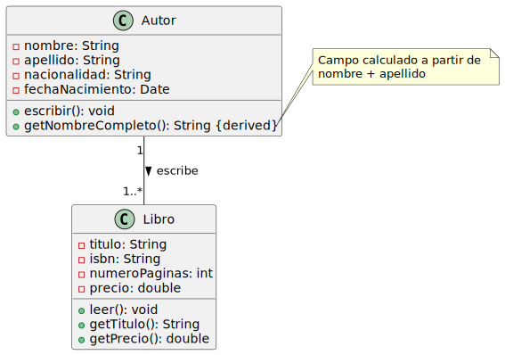
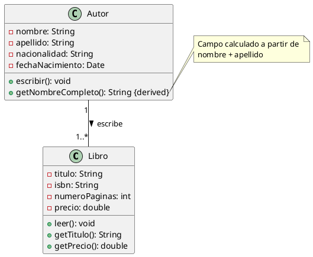

# Solución Ejercicio 1: Diagrama de Clases - Sistema de Libros y Autores

## Diagrama UML



## Código PlantUML



## Explicación del Diseño

### 1. Clases, Propiedades y Métodos

#### Clase Autor
**Propiedades (privadas):**
- `-nombre: String`: Almacena el nombre del autor. Es privado para proteger la encapsulación.
- `-apellido: String`: Almacena el apellido del autor. Es privado por las mismas razones.
- `-nacionalidad: String`: Indica el país de origen del autor. Privado para mantener consistencia.
- `-fechaNacimiento: Date`: Fecha de nacimiento del autor. Privado para control de acceso.

**Métodos (públicos):**
- `+escribir(): void`: Método público que representa la acción de escribir. No retorna valor.
- `+getNombreCompleto(): String {derived}`: Método público que retorna el nombre completo concatenando nombre y apellido. Marcado como `{derived}` porque es un campo calculado, no almacenado directamente.

#### Clase Libro
**Propiedades (privadas):**
- `-titulo: String`: Título del libro. Privado para proteger su modificación directa.
- `-isbn: String`: Código único de identificación del libro. Privado por seguridad.
- `-numeroPaginas: int`: Cantidad de páginas. Tipo entero, privado.
- `-precio: double`: Precio del libro. Tipo decimal para permitir valores con centavos, privado.

**Métodos (públicos):**
- `+leer(): void`: Método público que simula la lectura del libro. No retorna valor.
- `+getTitulo(): String`: Getter público para obtener el título del libro.
- `+getPrecio(): double`: Getter público para obtener el precio del libro.

### 2. Relaciones

**Tipo de relación:** Asociación (línea continua)

**Significado:** La línea que conecta Autor con Libro representa una relación de asociación que indica que un autor está vinculado con los libros que escribe.

**Implicaciones:**
- Cada objeto Autor puede tener referencias a múltiples objetos Libro
- Cada objeto Libro tiene una referencia a exactamente un objeto Autor
- Es una relación bidireccional: desde Autor se puede acceder a sus libros, y desde Libro se puede conocer su autor
- La flecha indica la navegabilidad y dirección de lectura de la relación

### 3. Roles y Cardinalidad

**Rol:** `escribe >`
- Describe la naturaleza de la relación desde la perspectiva del Autor
- Indica que el Autor realiza la acción de escribir sobre el Libro

**Cardinalidad:**
- **Lado Autor: `1`** - Cada libro es escrito por exactamente un autor (multiplicidad obligatoria y única)
- **Lado Libro: `1..*`** - Un autor debe escribir al menos un libro, pero puede escribir muchos (multiplicidad uno o más)

**Interpretación:**
- Un autor no puede existir en el sistema sin haber escrito al menos un libro
- No puede haber libros sin autor
- Un autor puede ser muy prolífico y escribir muchos libros
- Esta es una relación uno a muchos (1:N)

### 4. Implementación en Kotlin

```kotlin
import java.util.Date

/**
 * Clase que representa un Autor de libros
 */
class Autor(
    private val nombre: String,
    private val apellido: String,
    private val nacionalidad: String,
    private val fechaNacimiento: Date
) {
    // Lista de libros escritos por este autor
    private val libros: MutableList<Libro> = mutableListOf()
    
    /**
     * Simula la acción de escribir
     */
    fun escribir() {
        println("$nombreCompleto está escribiendo...")
    }
    
    /**
     * Retorna el nombre completo del autor (campo derivado)
     */
    fun getNombreCompleto(): String {
        return "$nombre $apellido"
    }
    
    // Propiedad calculada para acceso más natural en Kotlin
    val nombreCompleto: String
        get() = "$nombre $apellido"
    
    /**
     * Agrega un libro a la lista de libros del autor
     */
    fun agregarLibro(libro: Libro) {
        libros.add(libro)
    }
    
    /**
     * Retorna la lista de libros escritos
     */
    fun getLibros(): List<Libro> = libros.toList()
}

/**
 * Clase que representa un Libro
 */
class Libro(
    private val titulo: String,
    private val isbn: String,
    private val numeroPaginas: Int,
    private val precio: Double,
    private val autor: Autor
) {
    
    // Inicialización: al crear un libro, se agrega a la lista del autor
    init {
        autor.agregarLibro(this)
    }
    
    /**
     * Simula la acción de leer el libro
     */
    fun leer() {
        println("Leyendo el libro: $titulo")
    }
    
    /**
     * Retorna el título del libro
     */
    fun getTitulo(): String = titulo
    
    /**
     * Retorna el precio del libro
     */
    fun getPrecio(): Double = precio
    
    /**
     * Retorna el autor del libro
     */
    fun getAutor(): Autor = autor
}

// Ejemplo de uso
fun main() {
    // Crear un autor
    val autor = Autor(
        nombre = "Gabriel",
        apellido = "García Márquez",
        nacionalidad = "Colombiano",
        fechaNacimiento = Date(1927, 3, 6)
    )
    
    // Crear libros de ese autor
    val libro1 = Libro(
        titulo = "Cien años de soledad",
        isbn = "978-0307474728",
        numeroPaginas = 417,
        precio = 15.99,
        autor = autor
    )
    
    val libro2 = Libro(
        titulo = "El amor en los tiempos del cólera",
        isbn = "978-0307389732",
        numeroPaginas = 368,
        precio = 14.99,
        autor = autor
    )
    
    // Usar los objetos
    println("Autor: ${autor.getNombreCompleto()}")
    autor.escribir()
    libro1.leer()
    println("Precio: ${libro1.getPrecio()}")
    
    // Mostrar libros del autor
    println("\nLibros de ${autor.nombreCompleto}:")
    autor.getLibros().forEach { libro ->
        println("- ${libro.getTitulo()}")
    }
}
```

### Notas sobre la implementación Kotlin:

1. **Constructor primario**: Los parámetros del constructor están marcados como `private val` o `private var` según necesidad
2. **Propiedades calculadas**: Kotlin permite usar `val nombreCompleto: String get() = ...` como alternativa más idiomática
3. **Bidireccionalidad**: El bloque `init` en Libro asegura que la relación bidireccional se mantenga automáticamente
4. **Inmutabilidad**: Se usa `List` en lugar de `MutableList` en los getters para proteger la colección interna
5. **Cardinalidad**: Se asegura en el constructor de Libro que siempre haya un autor (1) y la lista permite múltiples libros (1..*)
