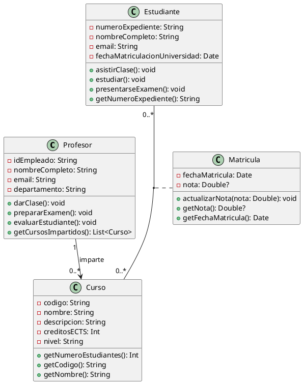
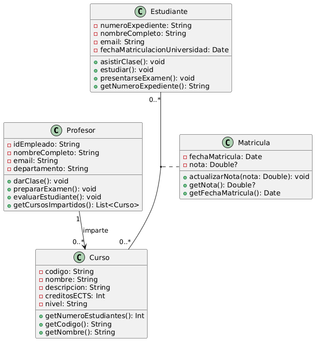

# Ejercicio 2: Solución - Sistema de Gestión de Cursos Universitarios

## Análisis del Diseño

### 1. Clases Identificadas

#### Clase **Profesor**
Representa a los docentes que imparten cursos en la universidad.

**Propiedades:**
- `-idEmpleado: String` - Identificador único del profesor (privado)
- `-nombreCompleto: String` - Nombre completo del profesor (privado)
- `-email: String` - Correo electrónico corporativo (privado)
- `-departamento: String` - Departamento al que pertenece (privado)

**Métodos:**
- `+darClase(): void` - Simula impartir una clase (público)
- `+prepararExamen(): void` - Prepara evaluaciones (público)
- `+evaluarEstudiante(): void` - Evalúa el rendimiento de estudiantes (público)
- `+getCursosImpartidos(): List<Curso>` - Retorna los cursos que imparte (público)

#### Clase **Curso**
Representa las asignaturas ofertadas por la universidad.

**Propiedades:**
- `-codigo: String` - Código único identificador del curso (privado)
- `-nombre: String` - Nombre del curso (privado)
- `-descripcion: String` - Descripción detallada del contenido (privado)
- `-creditosECTS: Int` - Créditos europeos del curso (privado)
- `-nivel: String` - Nivel académico: Grado, Máster o Doctorado (privado)

**Métodos:**
- `+getNumeroEstudiantes(): Int` - Retorna el número de estudiantes matriculados (público)
- `+getCodigo(): String` - Obtiene el código del curso (público)
- `+getNombre(): String` - Obtiene el nombre del curso (público)

#### Clase **Estudiante**
Representa a los alumnos matriculados en la universidad.

**Propiedades:**
- `-numeroExpediente: String` - Número único de expediente (privado)
- `-nombreCompleto: String` - Nombre completo del estudiante (privado)
- `-email: String` - Correo electrónico (privado)
- `-fechaMatriculacionUniversidad: Date` - Primera matrícula en la universidad (privado)

**Métodos:**
- `+asistirClase(): void` - Asiste a una clase (público)
- `+estudiar(): void` - Realiza estudio (público)
- `+presentarseExamen(): void` - Se presenta a un examen (público)
- `+getNumeroExpediente(): String` - Obtiene el número de expediente (público)

#### Clase **Matricula** (Clase de Asociación)
Representa el registro de matrícula de un estudiante en un curso específico. Esta clase surge de la relación muchos-a-muchos entre Estudiante y Curso, con atributos propios.

**Propiedades:**
- `-fechaMatricula: Date` - Fecha en que se realizó la matrícula (privado)
- `-nota: Double?` - Nota obtenida en el curso, puede ser nula inicialmente (privado)

**Métodos:**
- `+actualizarNota(nota: Double): void` - Actualiza la calificación (público)
- `+getNota(): Double?` - Obtiene la nota actual (público)
- `+getFechaMatricula(): Date` - Obtiene la fecha de matrícula (público)

### 2. Relaciones

#### Relación 1: Profesor → Curso (Asociación unidireccional)
- **Tipo:** Asociación simple
- **Dirección:** Unidireccional desde Profesor hacia Curso
- **Significado:** Un profesor imparte cursos
- **Rol:** "imparte" desde Profesor hacia Curso
- **Cardinalidad:** 
  - Profesor [1] → Curso [0..*]
  - Un profesor imparte cero o muchos cursos
  - Cada curso es impartido por exactamente un profesor
- **Implicaciones:** 
  - Un curso sin profesor asignado no debería existir (responsabilidad única)
  - Un profesor puede no impartir ningún curso (profesor investigador, por ejemplo)
  - La navegabilidad es unidireccional: desde Profesor podemos obtener sus cursos

#### Relación 2: Estudiante ↔ Curso a través de Matricula (Clase de Asociación)
- **Tipo:** Asociación muchos-a-muchos con clase de asociación
- **Dirección:** Bidireccional
- **Significado:** Los estudiantes se matriculan en cursos, generando registros de matrícula
- **Roles:** 
  - "se matricula en" desde Estudiante hacia Curso
  - "tiene matriculado a" desde Curso hacia Estudiante
- **Cardinalidad:**
  - Estudiante [0..*] ↔ Curso [0..*]
  - Un estudiante puede matricularse en cero o muchos cursos
  - Un curso puede tener cero o muchos estudiantes matriculados
- **Clase de Asociación:** Matricula
  - Cada instancia de Matricula representa una matrícula específica
  - Vincula un Estudiante con un Curso
  - Almacena información propia: fechaMatricula y nota
- **Implicaciones:**
  - No puede existir una Matricula sin Estudiante y Curso asociados
  - La misma combinación Estudiante-Curso solo puede tener una Matricula activa
  - Los atributos fechaMatricula y nota pertenecen a la relación, no a las clases principales
  - Permite modelar el histórico: un estudiante puede tener varias matrículas en diferentes cursos

### 3. Roles y Cardinalidad Detallados

| Relación | Clase Origen | Rol Origen | Cardinalidad Origen | Clase Destino | Rol Destino | Cardinalidad Destino |
|----------|--------------|------------|---------------------|---------------|-------------|---------------------|
| Imparte | Profesor | profesor responsable | 1 | Curso | imparte | 0..* |
| Matriculación | Estudiante | alumno | 0..* | Curso | se matricula en | 0..* |

**Cardinalidad 1:** Exactamente uno (obligatorio)
**Cardinalidad 0..*:** Cero o muchos (opcional, sin límite superior)

### 4. Justificación de Decisiones de Diseño

1. **Visibilidad privada para atributos:** Siguiendo el principio de encapsulación, los datos internos son privados y se acceden mediante métodos públicos (getters).

2. **Clase Matricula como clase de asociación:** La relación entre Estudiante y Curso no es simple, tiene datos propios (fecha y nota). En UML, cuando una asociación tiene atributos, se modela como clase de asociación.

3. **Métodos derivados:** `getNumeroEstudiantes()` en Curso es un método derivado que cuenta las matrículas activas, no es un atributo almacenado.

4. **Navegabilidad:** La relación Profesor-Curso es unidireccional porque solo necesitamos saber qué cursos imparte un profesor, no necesariamente al revés (aunque se podría implementar).

## Código PlantUML



## Diagrama Generado



## Implementación en Kotlin

```kotlin
import java.util.Date

/**
 * Clase que representa a un profesor universitario
 */
class Profesor(
    private val idEmpleado: String,
    private val nombreCompleto: String,
    private val email: String,
    private val departamento: String
) {
    private val cursosImpartidos = mutableListOf<Curso>()
    
    fun darClase() {
        println("$nombreCompleto está dando clase")
    }
    
    fun prepararExamen() {
        println("$nombreCompleto está preparando un examen")
    }
    
    fun evaluarEstudiante() {
        println("$nombreCompleto está evaluando estudiantes")
    }
    
    fun getCursosImpartidos(): List<Curso> = cursosImpartidos.toList()
    
    fun agregarCurso(curso: Curso) {
        cursosImpartidos.add(curso)
    }
}

/**
 * Clase que representa un curso universitario
 */
class Curso(
    private val codigo: String,
    private val nombre: String,
    private val descripcion: String,
    private val creditosECTS: Int,
    private val nivel: String // "Grado", "Máster", "Doctorado"
) {
    private val profesor: Profesor? = null
    private val matriculas = mutableListOf<Matricula>()
    
    fun getNumeroEstudiantes(): Int = matriculas.size
    
    fun getCodigo(): String = codigo
    
    fun getNombre(): String = nombre
    
    fun agregarMatricula(matricula: Matricula) {
        matriculas.add(matricula)
    }
}

/**
 * Clase que representa a un estudiante universitario
 */
class Estudiante(
    private val numeroExpediente: String,
    private val nombreCompleto: String,
    private val email: String,
    private val fechaMatriculacionUniversidad: Date
) {
    private val matriculas = mutableListOf<Matricula>()
    
    fun asistirClase() {
        println("$nombreCompleto está asistiendo a clase")
    }
    
    fun estudiar() {
        println("$nombreCompleto está estudiando")
    }
    
    fun presentarseExamen() {
        println("$nombreCompleto se está presentando a un examen")
    }
    
    fun getNumeroExpediente(): String = numeroExpediente
    
    fun matricularseEnCurso(curso: Curso): Matricula {
        val matricula = Matricula(this, curso, Date())
        matriculas.add(matricula)
        curso.agregarMatricula(matricula)
        return matricula
    }
}

/**
 * Clase de asociación que representa la matrícula de un estudiante en un curso
 */
class Matricula(
    private val estudiante: Estudiante,
    private val curso: Curso,
    private val fechaMatricula: Date
) {
    private var nota: Double? = null
    
    fun actualizarNota(nuevaNota: Double) {
        require(nuevaNota in 0.0..10.0) { "La nota debe estar entre 0 y 10" }
        nota = nuevaNota
    }
    
    fun getNota(): Double? = nota
    
    fun getFechaMatricula(): Date = fechaMatricula
}

// Ejemplo de uso
fun main() {
    // Crear profesor
    val profesor = Profesor(
        "P001",
        "Dr. Juan García",
        "juan.garcia@universidad.es",
        "Ingeniería Informática"
    )
    
    // Crear curso
    val curso = Curso(
        "EDES-101",
        "Entornos de Desarrollo",
        "Curso sobre herramientas y metodologías de desarrollo",
        6,
        "Grado"
    )
    
    profesor.agregarCurso(curso)
    
    // Crear estudiantes
    val estudiante1 = Estudiante(
        "E001",
        "María López",
        "maria.lopez@estudiante.es",
        Date()
    )
    
    val estudiante2 = Estudiante(
        "E002",
        "Carlos Ruiz",
        "carlos.ruiz@estudiante.es",
        Date()
    )
    
    // Matricular estudiantes
    val matricula1 = estudiante1.matricularseEnCurso(curso)
    val matricula2 = estudiante2.matricularseEnCurso(curso)
    
    // Actualizar notas
    matricula1.actualizarNota(8.5)
    matricula2.actualizarNota(7.0)
    
    // Verificar
    println("Curso: ${curso.getNombre()}")
    println("Número de estudiantes: ${curso.getNumeroEstudiantes()}")
    println("Nota de ${estudiante1.getNumeroExpediente()}: ${matricula1.getNota()}")
}
```

## Conceptos Clave Aplicados

1. **Encapsulación:** Atributos privados con acceso controlado mediante métodos públicos
2. **Asociación simple:** Relación Profesor-Curso (unidireccional)
3. **Clase de asociación:** Matricula representa la relación muchos-a-muchos con atributos propios
4. **Cardinalidad:** Especificación precisa de cuántas instancias pueden participar en cada relación
5. **Navegabilidad:** Control de la dirección en la que se puede recorrer una relación
6. **Tipos opcionales:** Uso de `Double?` en Kotlin para representar que la nota puede no estar asignada

## Criterios de Evaluación Cubiertos

- ✅ **CE a)** Conceptos básicos de POO identificados y aplicados
- ✅ **CE b)** Uso de PlantUML para elaborar el diagrama
- ✅ **CE c)** Interpretación correcta de las especificaciones
- ✅ **CE d)** Diagrama trazado desde especificaciones narrativas del cliente
- ✅ **CE e)** Código Kotlin generado a partir del diagrama de clases
