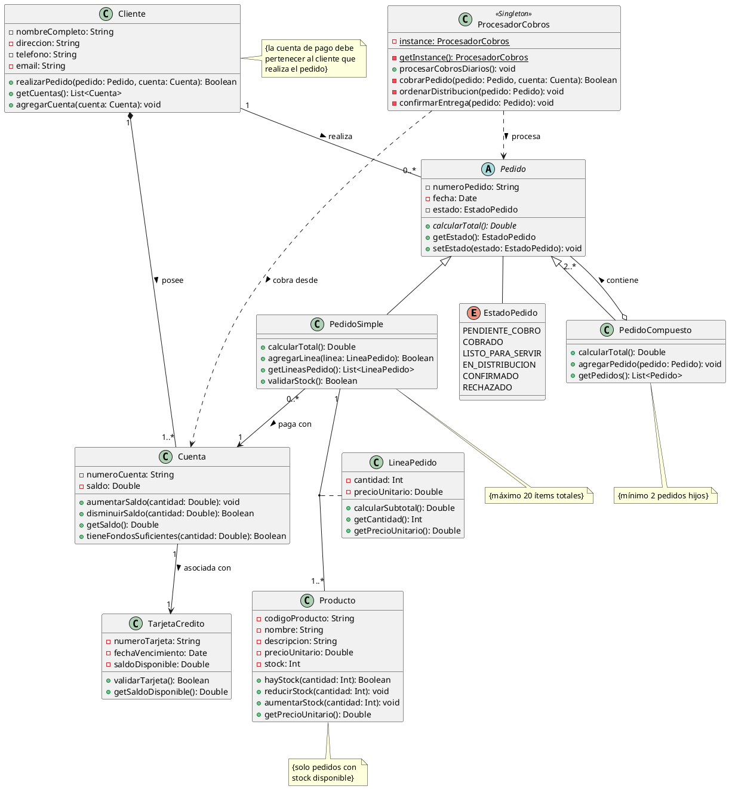
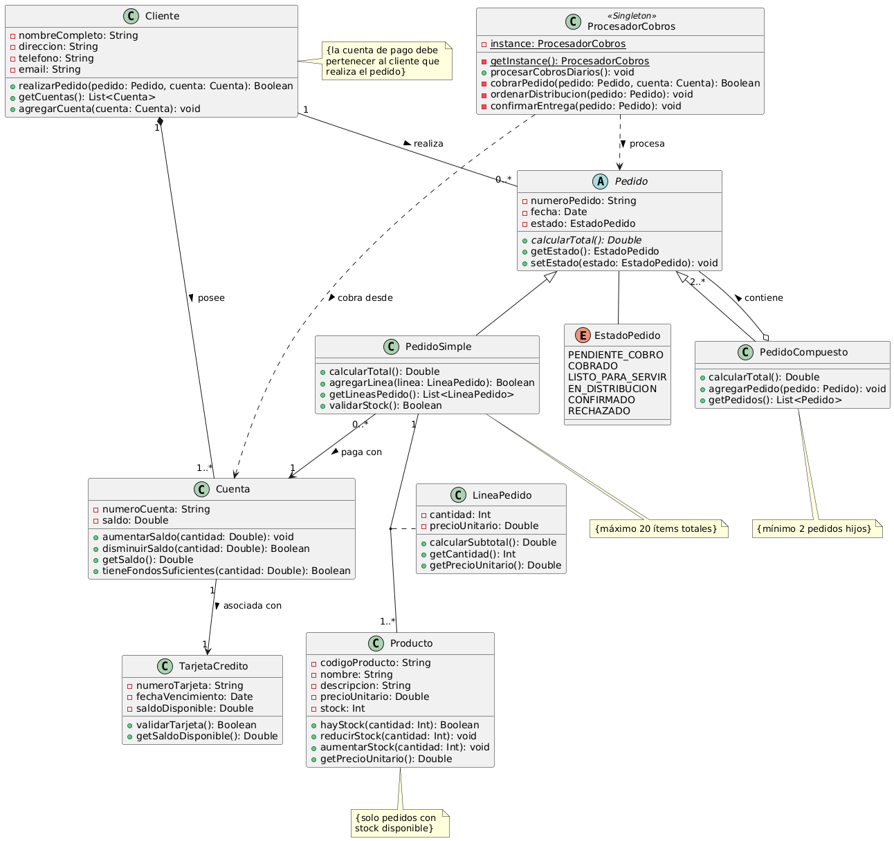

# Ejercicio 3: Solución - Sistema de Gestión de Pedidos E-Commerce

## Análisis del Diseño

### 1. Clases Identificadas

#### Clase **Cliente**
Representa a los usuarios que realizan compras en el sistema.

**Propiedades:**
- `-nombreCompleto: String` - Nombre completo del cliente (privado)
- `-direccion: String` - Dirección de envío (privado)
- `-telefono: String` - Número de contacto (privado)
- `-email: String` - Correo electrónico (privado)

**Métodos:**
- `+realizarPedido(pedido: Pedido, cuenta: Cuenta): Boolean` - Realiza un pedido usando una cuenta (público)
- `+getCuentas(): List<Cuenta>` - Obtiene las cuentas del cliente (público)
- `+agregarCuenta(cuenta: Cuenta): void` - Añade una cuenta al cliente (público)

#### Clase **Cuenta**
Representa las cuentas de pago de los clientes.

**Propiedades:**
- `-numeroCuenta: String` - Identificador único de la cuenta (privado)
- `-saldo: Double` - Saldo disponible actual (privado)

**Métodos:**
- `+aumentarSaldo(cantidad: Double): void` - Incrementa el saldo (público)
- `+disminuirSaldo(cantidad: Double): Boolean` - Reduce el saldo si hay fondos suficientes (público)
- `+getSaldo(): Double` - Obtiene el saldo actual (público)
- `+tieneFondosSuficientes(cantidad: Double): Boolean` - Verifica si hay fondos suficientes (público)

#### Clase **TarjetaCredito**
Representa la tarjeta de crédito asociada a una cuenta.

**Propiedades:**
- `-numeroTarjeta: String` - Número de la tarjeta (privado)
- `-fechaVencimiento: Date` - Fecha de expiración (privado)
- `-saldoDisponible: Double` - Límite de crédito disponible (privado)

**Métodos:**
- `+validarTarjeta(): Boolean` - Verifica si la tarjeta es válida (público)
- `+getSaldoDisponible(): Double` - Obtiene el saldo disponible (público)

#### Clase Abstracta **Pedido**
Clase base abstracta para todos los tipos de pedidos. Implementa el patrón Composite.

**Propiedades:**
- `-numeroPedido: String` - Identificador único del pedido (privado)
- `-fecha: Date` - Fecha de realización del pedido (privado)
- `-estado: EstadoPedido` - Estado actual del pedido (privado)

**Métodos:**
- `+calcularTotal(): Double` - Calcula el importe total del pedido (abstracto, público)
- `+getEstado(): EstadoPedido` - Obtiene el estado del pedido (público)
- `+setEstado(estado: EstadoPedido): void` - Cambia el estado del pedido (público)

#### Clase **PedidoSimple** (hereda de Pedido)
Representa un pedido con productos directos, máximo 20 ítems.

**Propiedades:**
- `{constraint: máximo 20 ítems totales}`

**Métodos:**
- `+calcularTotal(): Double` - Suma el total de todas las líneas de pedido (público)
- `+agregarLinea(linea: LineaPedido): Boolean` - Añade una línea si no excede 20 ítems (público)
- `+getLineasPedido(): List<LineaPedido>` - Obtiene las líneas del pedido (público)
- `+validarStock(): Boolean` - Verifica que hay stock suficiente (público)

#### Clase **PedidoCompuesto** (hereda de Pedido)
Representa un pedido que agrupa otros pedidos (simples o compuestos).

**Propiedades:**
- `{constraint: mínimo 2 pedidos hijos}`

**Métodos:**
- `+calcularTotal(): Double` - Suma recursivamente los totales de los pedidos hijos (público)
- `+agregarPedido(pedido: Pedido): void` - Añade un pedido hijo (público)
- `+getPedidos(): List<Pedido>` - Obtiene los pedidos que componen este pedido (público)

#### Clase **LineaPedido** (Clase de Asociación)
Representa la línea de un pedido con un producto específico.

**Propiedades:**
- `-cantidad: Int` - Cantidad de unidades solicitadas (privado)
- `-precioUnitario: Double` - Precio unitario aplicado en el momento del pedido (privado)

**Métodos:**
- `+calcularSubtotal(): Double` - Calcula cantidad * precioUnitario (público)
- `+getCantidad(): Int` - Obtiene la cantidad (público)
- `+getPrecioUnitario(): Double` - Obtiene el precio unitario (público)

#### Clase **Producto**
Representa los artículos disponibles para la venta.

**Propiedades:**
- `-codigoProducto: String` - Código identificador único (privado)
- `-nombre: String` - Nombre del producto (privado)
- `-descripcion: String` - Descripción detallada (privado)
- `-precioUnitario: Double` - Precio actual del producto (privado)
- `-stock: Int` - Cantidad disponible en inventario (privado)

**Métodos:**
- `+hayStock(cantidad: Int): Boolean` - Verifica si hay stock suficiente (público)
- `+reducirStock(cantidad: Int): void` - Reduce el stock tras una venta (público)
- `+aumentarStock(cantidad: Int): void` - Incrementa el stock (público)
- `+getPrecioUnitario(): Double` - Obtiene el precio actual (público)

#### Clase **ProcesadorCobros** (Singleton)
Clase única responsable del proceso de cobro diario. Implementa el patrón Singleton.

**Propiedades:**
- `-instance: ProcesadorCobros {static}` - Única instancia de la clase (privado, estático)

**Métodos:**
- `+getInstance(): ProcesadorCobros {static}` - Obtiene la instancia única (público, estático)
- `+procesarCobrosDiarios(): void` - Procesa todos los pedidos pendientes (público)
- `+cobrarPedido(pedido: Pedido, cuenta: Cuenta): Boolean` - Cobra un pedido específico (privado)
- `+ordenarDistribucion(pedido: Pedido): void` - Ordena el envío del pedido (privado)
- `+confirmarEntrega(pedido: Pedido): void` - Confirma la entrega (privado)

#### Enumeración **EstadoPedido**
Define los posibles estados de un pedido.

**Valores:**
- `PENDIENTE_COBRO` - Pedido creado, esperando cobro
- `COBRADO` - Cobro realizado con éxito
- `LISTO_PARA_SERVIR` - Preparado para envío
- `EN_DISTRIBUCION` - En proceso de entrega
- `CONFIRMADO` - Entregado al cliente
- `RECHAZADO` - Rechazado por falta de fondos

### 2. Relaciones

#### Relación 1: Cliente ↔ Cuenta (Composición)
- **Tipo:** Composición (diamante negro)
- **Significado:** Un cliente posee cuentas
- **Cardinalidad:** Cliente [1] ◆─ [1..*] Cuenta
- **Implicaciones:**
  - Un cliente debe tener al menos una cuenta
  - Una cuenta no puede existir sin un cliente
  - Si se elimina el cliente, se eliminan sus cuentas (ciclo de vida dependiente)

#### Relación 2: Cuenta ─ TarjetaCredito (Asociación unidireccional)
- **Tipo:** Asociación simple
- **Significado:** Una cuenta está asociada con una tarjeta de crédito
- **Cardinalidad:** Cuenta [1] ─ [1] TarjetaCredito
- **Implicaciones:**
  - Cada cuenta tiene exactamente una tarjeta asociada
  - Una tarjeta pertenece a una única cuenta

#### Relación 3: Cliente ─ Pedido (Asociación con constraint)
- **Tipo:** Asociación con restricción
- **Significado:** Un cliente realiza pedidos
- **Cardinalidad:** Cliente [1] ─ [0..*] Pedido
- **Constraint:** `{la cuenta de pago debe pertenecer al mismo cliente}`
- **Implicaciones:**
  - Un cliente puede tener cero o muchos pedidos
  - Cada pedido pertenece a exactamente un cliente
  - Restricción de seguridad: validación en tiempo de ejecución

#### Relación 4: PedidoSimple ─ Cuenta (Asociación)
- **Tipo:** Asociación simple
- **Significado:** Un pedido simple se paga con una cuenta
- **Cardinalidad:** PedidoSimple [0..*] ─ [1] Cuenta
- **Implicaciones:**
  - Cada pedido simple debe tener una cuenta de pago asignada
  - Una cuenta puede usarse para múltiples pedidos

#### Relación 5: Pedido ◁─ PedidoSimple y PedidoCompuesto (Herencia)
- **Tipo:** Generalización/Especialización
- **Significado:** PedidoSimple y PedidoCompuesto son tipos de Pedido
- **Implicaciones:**
  - Patrón Composite aplicado
  - Pedido es clase abstracta
  - Polimorfismo: ambos tipos implementan calcularTotal()

#### Relación 6: PedidoCompuesto ◇─ Pedido (Agregación recursiva)
- **Tipo:** Agregación (diamante blanco) recursiva
- **Significado:** Un pedido compuesto contiene otros pedidos
- **Cardinalidad:** PedidoCompuesto [0..1] ◇─ [2..*] Pedido
- **Constraint:** `{mínimo 2 pedidos}`
- **Implicaciones:**
  - Patrón Composite: estructura jerárquica recursiva
  - Un pedido hijo puede ser simple o compuesto
  - Permite árboles de pedidos de cualquier profundidad

#### Relación 7: PedidoSimple ↔ Producto a través de LineaPedido (Clase de Asociación)
- **Tipo:** Asociación muchos-a-muchos con clase de asociación
- **Significado:** Un pedido contiene productos con cantidades y precios específicos
- **Cardinalidad:** PedidoSimple [1] ↔ [1..*] Producto
- **Clase de Asociación:** LineaPedido
- **Constraint:** `{máximo 20 líneas por pedido}`
- **Implicaciones:**
  - Cada línea representa un producto en el pedido
  - Captura precio histórico (puede diferir del precio actual)
  - Permite calcular subtotales

#### Relación 8: ProcesadorCobros ─ Pedido (Dependencia)
- **Tipo:** Dependencia
- **Significado:** ProcesadorCobros procesa pedidos
- **Implicaciones:**
  - Singleton procesa todos los pedidos
  - Acceso unidireccional para procesamiento

### 3. Patrones de Diseño Aplicados

#### Patrón Singleton (ProcesadorCobros)
- **Propósito:** Garantizar una única instancia del procesador de cobros
- **Implementación:**
  - Constructor privado
  - Método estático getInstance()
  - Instancia única almacenada como atributo estático
- **Justificación:** Solo debe existir un proceso de cobro centralizado

#### Patrón Composite (Pedido, PedidoSimple, PedidoCompuesto)
- **Propósito:** Tratar objetos individuales y composiciones uniformemente
- **Implementación:**
  - Component: Pedido (abstracto)
  - Leaf: PedidoSimple
  - Composite: PedidoCompuesto
  - Operación común: calcularTotal()
- **Justificación:** Permite estructuras jerárquicas de pedidos con cálculo recursivo

### 4. Restricciones (Constraints) UML

1. **Cliente-Pedido-Cuenta:** `{la cuenta de pago debe pertenecer al cliente que realiza el pedido}`
2. **PedidoSimple:** `{máximo 20 ítems totales}`
3. **PedidoCompuesto:** `{mínimo 2 pedidos hijos}`
4. **Stock:** `{solo se pueden pedir productos con stock disponible}`
5. **Saldo:** `{el saldo de la cuenta debe ser >= total del pedido}`

### 5. Diagrama de Estados del Pedido

Un pedido pasa por los siguientes estados:

```
PENDIENTE_COBRO → COBRADO → LISTO_PARA_SERVIR → EN_DISTRIBUCION → CONFIRMADO
                     ↓
                 RECHAZADO (si no hay fondos)
```

## Código PlantUML



## Diagrama Generado



## Implementación en Kotlin

```kotlin
import java.util.Date

// Enumeración de estados del pedido
enum class EstadoPedido {
    PENDIENTE_COBRO,
    COBRADO,
    LISTO_PARA_SERVIR,
    EN_DISTRIBUCION,
    CONFIRMADO,
    RECHAZADO
}

/**
 * Clase que representa a un cliente del sistema
 */
class Cliente(
    private val nombreCompleto: String,
    private val direccion: String,
    private val telefono: String,
    private val email: String
) {
    private val cuentas = mutableListOf<Cuenta>()
    private val pedidos = mutableListOf<Pedido>()
    
    fun agregarCuenta(cuenta: Cuenta) {
        cuentas.add(cuenta)
    }
    
    fun getCuentas(): List<Cuenta> = cuentas.toList()
    
    fun realizarPedido(pedido: Pedido, cuenta: Cuenta): Boolean {
        // Validar que la cuenta pertenece al cliente
        if (!cuentas.contains(cuenta)) {
            println("Error: La cuenta no pertenece a este cliente")
            return false
        }
        
        // Validar que hay fondos suficientes
        val total = pedido.calcularTotal()
        if (!cuenta.tieneFondosSuficientes(total)) {
            println("Error: Fondos insuficientes")
            return false
        }
        
        // Si es pedido simple, validar stock
        if (pedido is PedidoSimple && !pedido.validarStock()) {
            println("Error: Stock insuficiente")
            return false
        }
        
        pedidos.add(pedido)
        return true
    }
}

/**
 * Clase que representa una cuenta de pago
 */
class Cuenta(
    private val numeroCuenta: String,
    private var saldo: Double
) {
    private lateinit var tarjeta: TarjetaCredito
    
    fun asociarTarjeta(tarjeta: TarjetaCredito) {
        this.tarjeta = tarjeta
    }
    
    fun aumentarSaldo(cantidad: Double) {
        require(cantidad > 0) { "La cantidad debe ser positiva" }
        saldo += cantidad
    }
    
    fun disminuirSaldo(cantidad: Double): Boolean {
        if (cantidad > saldo) {
            return false
        }
        saldo -= cantidad
        return true
    }
    
    fun getSaldo(): Double = saldo
    
    fun tieneFondosSuficientes(cantidad: Double): Boolean = saldo >= cantidad
}

/**
 * Clase que representa una tarjeta de crédito
 */
class TarjetaCredito(
    private val numeroTarjeta: String,
    private val fechaVencimiento: Date,
    private val saldoDisponible: Double
) {
    fun validarTarjeta(): Boolean {
        val ahora = Date()
        return fechaVencimiento.after(ahora) && saldoDisponible > 0
    }
    
    fun getSaldoDisponible(): Double = saldoDisponible
}

/**
 * Clase abstracta base para todos los pedidos (Patrón Composite - Component)
 */
abstract class Pedido(
    protected val numeroPedido: String,
    protected val fecha: Date
) {
    protected var estado: EstadoPedido = EstadoPedido.PENDIENTE_COBRO
    
    abstract fun calcularTotal(): Double
    
    fun getEstado(): EstadoPedido = estado
    
    fun setEstado(nuevoEstado: EstadoPedido) {
        estado = nuevoEstado
    }
}

/**
 * Clase que representa un pedido simple (Patrón Composite - Leaf)
 */
class PedidoSimple(
    numeroPedido: String,
    fecha: Date,
    private val cuentaPago: Cuenta
) : Pedido(numeroPedido, fecha) {
    private val lineasPedido = mutableListOf<LineaPedido>()
    
    companion object {
        const val MAX_ITEMS = 20
    }
    
    fun agregarLinea(linea: LineaPedido): Boolean {
        val itemsActuales = lineasPedido.sumOf { it.getCantidad() }
        val nuevosItems = itemsActuales + linea.getCantidad()
        
        if (nuevosItems > MAX_ITEMS) {
            println("Error: Se excede el máximo de $MAX_ITEMS ítems")
            return false
        }
        
        lineasPedido.add(linea)
        return true
    }
    
    fun getLineasPedido(): List<LineaPedido> = lineasPedido.toList()
    
    fun validarStock(): Boolean {
        return lineasPedido.all { linea ->
            linea.producto.hayStock(linea.getCantidad())
        }
    }
    
    override fun calcularTotal(): Double {
        return lineasPedido.sumOf { it.calcularSubtotal() }
    }
    
    fun getCuentaPago(): Cuenta = cuentaPago
}

/**
 * Clase que representa un pedido compuesto (Patrón Composite - Composite)
 */
class PedidoCompuesto(
    numeroPedido: String,
    fecha: Date
) : Pedido(numeroPedido, fecha) {
    private val pedidosHijos = mutableListOf<Pedido>()
    
    fun agregarPedido(pedido: Pedido) {
        pedidosHijos.add(pedido)
    }
    
    fun getPedidos(): List<Pedido> = pedidosHijos.toList()
    
    override fun calcularTotal(): Double {
        require(pedidosHijos.size >= 2) { "Un pedido compuesto debe tener al menos 2 pedidos" }
        return pedidosHijos.sumOf { it.calcularTotal() }
    }
}

/**
 * Clase de asociación que representa una línea de pedido
 */
class LineaPedido(
    val producto: Producto,
    private val cantidad: Int,
    private val precioUnitario: Double
) {
    init {
        require(cantidad > 0) { "La cantidad debe ser positiva" }
    }
    
    fun calcularSubtotal(): Double = cantidad * precioUnitario
    
    fun getCantidad(): Int = cantidad
    
    fun getPrecioUnitario(): Double = precioUnitario
}

/**
 * Clase que representa un producto
 */
class Producto(
    private val codigoProducto: String,
    private val nombre: String,
    private val descripcion: String,
    private var precioUnitario: Double,
    private var stock: Int
) {
    fun hayStock(cantidad: Int): Boolean = stock >= cantidad
    
    fun reducirStock(cantidad: Int) {
        require(cantidad <= stock) { "Stock insuficiente" }
        stock -= cantidad
    }
    
    fun aumentarStock(cantidad: Int) {
        require(cantidad > 0) { "La cantidad debe ser positiva" }
        stock += cantidad
    }
    
    fun getPrecioUnitario(): Double = precioUnitario
    
    fun getNombre(): String = nombre
}

/**
 * Clase Singleton responsable del procesamiento de cobros
 */
class ProcesadorCobros private constructor() {
    
    companion object {
        @Volatile
        private var instance: ProcesadorCobros? = null
        
        fun getInstance(): ProcesadorCobros {
            return instance ?: synchronized(this) {
                instance ?: ProcesadorCobros().also { instance = it }
            }
        }
    }
    
    private val pedidosPendientes = mutableListOf<Pair<Pedido, Cuenta>>()
    
    fun registrarPedido(pedido: Pedido, cuenta: Cuenta) {
        if (pedido is PedidoSimple) {
            pedidosPendientes.add(Pair(pedido, cuenta))
        }
    }
    
    fun procesarCobrosDiarios() {
        println("=== Procesando cobros diarios ===")
        
        val pendientes = pedidosPendientes.filter { 
            it.first.getEstado() == EstadoPedido.PENDIENTE_COBRO 
        }
        
        pendientes.forEach { (pedido, cuenta) ->
            if (cobrarPedido(pedido, cuenta)) {
                ordenarDistribucion(pedido)
            }
        }
    }
    
    private fun cobrarPedido(pedido: Pedido, cuenta: Cuenta): Boolean {
        val total = pedido.calcularTotal()
        
        return if (cuenta.disminuirSaldo(total)) {
            pedido.setEstado(EstadoPedido.COBRADO)
            println("Pedido cobrado exitosamente: $total€")
            true
        } else {
            pedido.setEstado(EstadoPedido.RECHAZADO)
            println("Pedido rechazado por fondos insuficientes")
            false
        }
    }
    
    private fun ordenarDistribucion(pedido: Pedido) {
        pedido.setEstado(EstadoPedido.LISTO_PARA_SERVIR)
        println("Pedido listo para distribución")
        
        // Simular distribución
        pedido.setEstado(EstadoPedido.EN_DISTRIBUCION)
    }
    
    fun confirmarEntrega(pedido: Pedido) {
        pedido.setEstado(EstadoPedido.CONFIRMADO)
        println("Pedido confirmado y entregado")
    }
}

// Ejemplo de uso
fun main() {
    // Crear productos
    val producto1 = Producto("P001", "Laptop", "Laptop gaming", 1200.0, 10)
    val producto2 = Producto("P002", "Mouse", "Mouse inalámbrico", 25.0, 50)
    val producto3 = Producto("P003", "Teclado", "Teclado mecánico", 80.0, 30)
    
    // Crear cliente
    val cliente = Cliente(
        "Ana Martínez",
        "Calle Principal 123",
        "666777888",
        "ana@email.com"
    )
    
    // Crear cuenta y tarjeta
    val tarjeta = TarjetaCredito("4532-1111-2222-3333", Date(2026, 12, 31), 5000.0)
    val cuenta = Cuenta("ES12-3456-7890", 2000.0)
    cuenta.asociarTarjeta(tarjeta)
    cliente.agregarCuenta(cuenta)
    
    // Crear pedido simple
    val pedidoSimple = PedidoSimple("PED001", Date(), cuenta)
    pedidoSimple.agregarLinea(LineaPedido(producto1, 1, producto1.getPrecioUnitario()))
    pedidoSimple.agregarLinea(LineaPedido(producto2, 2, producto2.getPrecioUnitario()))
    
    // Realizar pedido
    if (cliente.realizarPedido(pedidoSimple, cuenta)) {
        println("Pedido realizado exitosamente")
        println("Total: ${pedidoSimple.calcularTotal()}€")
        
        // Registrar para cobro
        val procesador = ProcesadorCobros.getInstance()
        procesador.registrarPedido(pedidoSimple, cuenta)
        
        // Procesar cobros
        procesador.procesarCobrosDiarios()
        
        println("Estado final: ${pedidoSimple.getEstado()}")
        println("Saldo restante: ${cuenta.getSaldo()}€")
    }
    
    // Ejemplo de pedido compuesto
    println("\n=== Creando pedido compuesto ===")
    
    val pedido2 = PedidoSimple("PED002", Date(), cuenta)
    pedido2.agregarLinea(LineaPedido(producto3, 1, producto3.getPrecioUnitario()))
    
    val pedido3 = PedidoSimple("PED003", Date(), cuenta)
    pedido3.agregarLinea(LineaPedido(producto2, 3, producto2.getPrecioUnitario()))
    
    val pedidoCompuesto = PedidoCompuesto("PEDCOMP001", Date())
    pedidoCompuesto.agregarPedido(pedido2)
    pedidoCompuesto.agregarPedido(pedido3)
    
    println("Total pedido compuesto: ${pedidoCompuesto.calcularTotal()}€")
}
```

## Conceptos Avanzados Aplicados

### 1. Patrón Singleton
- Constructor privado para evitar instanciación directa
- Método estático `getInstance()` con lazy initialization
- Thread-safe usando `@Volatile` y `synchronized`

### 2. Patrón Composite
- Estructura jerárquica de pedidos
- Operación polimórfica `calcularTotal()`
- Transparencia: ambos tipos de pedido se tratan uniformemente

### 3. Composición vs Agregación
- **Composición** (Cliente-Cuenta): Las cuentas no existen sin cliente
- **Agregación** (PedidoCompuesto-Pedido): Los pedidos hijo pueden existir independientemente

### 4. Clase de Asociación
- LineaPedido captura atributos de la relación Pedido-Producto
- Permite histórico de precios (inmutabilidad del precio en la línea)

### 5. Restricciones de Negocio
- Validación de límite de ítems en PedidoSimple
- Verificación de propiedad cuenta-cliente
- Control de stock antes de confirmar pedido

## Criterios de Evaluación Cubiertos

- ✅ **CE a)** Conceptos avanzados: herencia, polimorfismo, patrones Singleton y Composite
- ✅ **CE b)** Uso de PlantUML para diagrama complejo con múltiples tipos de relaciones
- ✅ **CE c)** Interpretación de especificaciones complejas del mundo real
- ✅ **CE d)** Diagrama con herencia, composición, agregación, clases de asociación
- ✅ **CE e)** Código Kotlin completo con implementación de patrones de diseño
- ✅ **CE f)** Posibilidad de ingeniería inversa desde el código generado

## Notas de Diseño

1. **Separación de Responsabilidades:** Cada clase tiene una responsabilidad única y bien definida

2. **Escalabilidad:** El patrón Composite permite árboles de pedidos de cualquier profundidad

3. **Mantenibilidad:** Los estados están encapsulados en enumeración, fácil de extender

4. **Seguridad:** Las validaciones garantizan integridad de datos y reglas de negocio

5. **Flexibilidad:** El sistema permite múltiples cuentas por cliente y diferentes estructuras de pedidos
