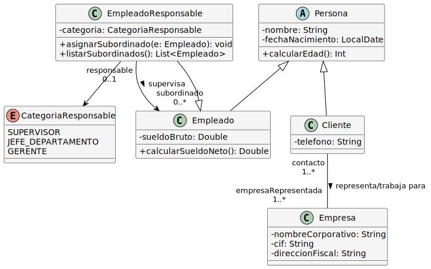
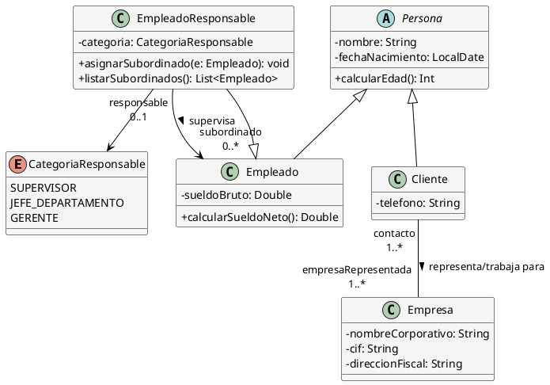

# Solución: Ejercicio 4 - Sistema de Gestión Empresarial

## Análisis del Problema

### Identificación de Clases

Del análisis de las especificaciones, identificamos las siguientes clases:

1. **Persona** (Clase abstracta)
   - Clase padre que agrupa características comunes de empleados y clientes
   - Atributos: nombre, fechaNacimiento
   - Métodos: calcularEdad()

2. **Empleado** (Especialización de Persona)
   - Representa a los trabajadores de la empresa
   - Atributos: sueldoBruto
   - Métodos: calcularSueldoNeto()

3. **EmpleadoResponsable** (Especialización de Empleado)
   - Empleados con personal a cargo
   - Atributos: categoria (tipo enumerado)
   - Relación reflexiva: tiene subordinados (otros Empleados)

4. **Cliente** (Especialización de Persona)
   - Representa a los contactos comerciales
   - Atributos: telefono
   - Relación: pertenece a una o más empresas

5. **Empresa**
   - Representa las organizaciones cliente
   - Atributos: nombreCorporativo, cif, direccionFiscal
   - Relación: tiene uno o más clientes de contacto

6. **CategoriaResponsable** (Enumeración)
   - Define los tipos de empleados responsables
   - Valores: SUPERVISOR, JEFE_DEPARTAMENTO, GERENTE

## Análisis de Relaciones

### 1. Herencia
- **Persona → Empleado**: Herencia simple, Empleado "es una" Persona
- **Persona → Cliente**: Herencia simple, Cliente "es una" Persona  
- **Empleado → EmpleadoResponsable**: Herencia simple, EmpleadoResponsable "es un" Empleado con capacidades adicionales

### 2. Asociación Reflexiva (Empleado - Empleado)
- **Nombre**: "supervisa" / "es supervisado por"
- **Tipo**: Asociación reflexiva
- **Cardinalidad**: 
  - Un EmpleadoResponsable puede tener 0..* subordinados (Empleados)
  - Un Empleado puede tener 0..1 responsable (EmpleadoResponsable)
- **Justificación**: Un empleado responsable puede gestionar múltiples subordinados, pero un subordinado solo reporta a un responsable

### 3. Asociación (Cliente - Empresa)
- **Nombre**: "trabaja para" / "tiene como contacto"
- **Tipo**: Asociación bidireccional
- **Cardinalidad**: 
  - Un Cliente pertenece a 1..* Empresas (al menos una, puede ser más)
  - Una Empresa tiene 1..* Clientes (al menos un contacto)
- **Justificación**: Refleja que no trabajamos con clientes particulares, siempre asociados a empresas

## Tabla de Roles y Cardinalidades

| Relación | Clase Origen | Rol Origen | Cardinalidad Origen | Clase Destino | Rol Destino | Cardinalidad Destino |
|----------|--------------|------------|---------------------|---------------|-------------|----------------------|
| Herencia | Persona | - | - | Empleado | - | - |
| Herencia | Persona | - | - | Cliente | - | - |
| Herencia | Empleado | - | - | EmpleadoResponsable | - | - |
| Supervisa | EmpleadoResponsable | responsable | 0..1 | Empleado | subordinado | 0..* |
| Representa | Cliente | contacto | 1..* | Empresa | empresaRepresentada | 1..* |

## Decisiones de Diseño

### ¿Por qué una clase Persona abstracta?
Empleados y Clientes comparten atributos comunes (nombre, fechaNacimiento) y comportamiento (calcularEdad). Usar una clase padre elimina duplicación de código y permite polimorfismo. Se define como abstracta porque no tiene sentido instanciar "Persona" directamente - siempre será Empleado o Cliente.

### ¿Por qué EmpleadoResponsable hereda de Empleado?
Un empleado responsable **es un** empleado con responsabilidades adicionales. Comparte todos los atributos de un empleado (incluido sueldo) pero añade la capacidad de supervisar subordinados y tiene una categoría específica.

### ¿Por qué usar asociación reflexiva?
La relación "responsable-subordinado" es entre instancias de la misma clase (Empleado). Esto modela jerárquicamente la cadena de mando sin necesitar clases adicionales.

### ¿Por qué la edad es un método y no un atributo?
La edad es un **dato derivado** que cambia con el tiempo. Almacenarla sería redundante y requeriría actualizaciones constantes. Es más eficiente calcularla cuando se necesita a partir de la fecha de nacimiento.

### ¿Sueldos con decimales o enteros?
Usamos Double para sueldos porque representan valores monetarios que pueden tener céntimos (euros.céntimos). Aunque en producción real se usarían tipos específicos como BigDecimal para evitar errores de redondeo.

## Diagrama de Clases



## Código PlantUML



## Implementación en Kotlin

```kotlin
import java.time.LocalDate
import java.time.Period

/**
 * Enumeración para las categorías de empleados responsables
 */
enum class CategoriaResponsable {
    SUPERVISOR,
    JEFE_DEPARTAMENTO,
    GERENTE
}

/**
 * Clase abstracta que representa una persona genérica
 */
abstract class Persona(
    protected val nombre: String,
    protected val fechaNacimiento: LocalDate
) {
    /**
     * Calcula la edad actual de la persona
     */
    fun calcularEdad(): Int {
        return Period.between(fechaNacimiento, LocalDate.now()).years
    }
    
    override fun toString(): String {
        return "$nombre (${calcularEdad()} años)"
    }
}

/**
 * Clase que representa un empleado de la empresa
 */
open class Empleado(
    nombre: String,
    fechaNacimiento: LocalDate,
    private val sueldoBruto: Double
) : Persona(nombre, fechaNacimiento) {
    
    /**
     * Calcula el sueldo neto aplicando retención del 22%
     */
    fun calcularSueldoNeto(): Double {
        return sueldoBruto * 0.78 // Retención del 22%
    }
    
    override fun toString(): String {
        return "Empleado: $nombre - Sueldo Bruto: €%.2f - Sueldo Neto: €%.2f".format(
            sueldoBruto, 
            calcularSueldoNeto()
        )
    }
}

/**
 * Clase que representa un empleado con responsabilidades de supervisión
 */
class EmpleadoResponsable(
    nombre: String,
    fechaNacimiento: LocalDate,
    sueldoBruto: Double,
    val categoria: CategoriaResponsable
) : Empleado(nombre, fechaNacimiento, sueldoBruto) {
    
    private val subordinados: MutableList<Empleado> = mutableListOf()
    
    /**
     * Asigna un subordinado a este empleado responsable
     */
    fun asignarSubordinado(empleado: Empleado) {
        if (empleado !in subordinados) {
            subordinados.add(empleado)
            println("✓ ${empleado.toString().substringAfter(": ").substringBefore(" -")} asignado como subordinado")
        }
    }
    
    /**
     * Lista todos los subordinados
     */
    fun listarSubordinados(): List<Empleado> {
        return subordinados.toList()
    }
    
    override fun toString(): String {
        return "Empleado Responsable ($categoria): $nombre - Subordinados: ${subordinados.size}"
    }
}

/**
 * Clase que representa un cliente
 */
class Cliente(
    nombre: String,
    fechaNacimiento: LocalDate,
    private val telefono: String
) : Persona(nombre, fechaNacimiento) {
    
    private val empresas: MutableList<Empresa> = mutableListOf()
    
    /**
     * Asocia el cliente a una empresa
     */
    fun agregarEmpresa(empresa: Empresa) {
        if (empresa !in empresas) {
            empresas.add(empresa)
            empresa.agregarCliente(this)
        }
    }
    
    fun listarEmpresas(): List<Empresa> = empresas.toList()
    
    override fun toString(): String {
        return "Cliente: $nombre - Tel: $telefono - Empresas: ${empresas.size}"
    }
}

/**
 * Clase que representa una empresa cliente
 */
class Empresa(
    private val nombreCorporativo: String,
    private val cif: String,
    private val direccionFiscal: String
) {
    private val clientes: MutableList<Cliente> = mutableListOf()
    
    /**
     * Agrega un cliente de contacto (uso interno)
     */
    internal fun agregarCliente(cliente: Cliente) {
        if (cliente !in clientes) {
            clientes.add(cliente)
        }
    }
    
    fun listarClientes(): List<Cliente> = clientes.toList()
    
    override fun toString(): String {
        return "Empresa: $nombreCorporativo (CIF: $cif) - Clientes: ${clientes.size}"
    }
}

/**
 * Función principal de demostración
 */
fun main() {
    println("=== SISTEMA DE GESTIÓN EMPRESARIAL ===\n")
    
    // Crear empresas
    val empresaTech = Empresa("TechCorp S.A.", "B12345678", "Calle Innovación 10, Madrid")
    val empresaConsulting = Empresa("Consulting Plus S.L.", "B87654321", "Avenida Negocio 25, Barcelona")
    
    println("--- EMPRESAS REGISTRADAS ---")
    println(empresaTech)
    println(empresaConsulting)
    println()
    
    // Crear clientes
    val cliente1 = Cliente("Ana García", LocalDate.of(1985, 3, 15), "666-111-222")
    val cliente2 = Cliente("Carlos Ruiz", LocalDate.of(1990, 7, 22), "666-333-444")
    
    // Asociar clientes a empresas
    println("--- ASOCIANDO CLIENTES A EMPRESAS ---")
    cliente1.agregarEmpresa(empresaTech)
    cliente1.agregarEmpresa(empresaConsulting) // Cliente trabaja para 2 empresas
    cliente2.agregarEmpresa(empresaTech)
    println()
    
    println("--- CLIENTES REGISTRADOS ---")
    println(cliente1)
    println(cliente2)
    println()
    
    // Crear empleados responsables
    val gerente = EmpleadoResponsable(
        "Laura Martínez", 
        LocalDate.of(1978, 5, 10), 
        5000.0,
        CategoriaResponsable.GERENTE
    )
    
    val supervisor = EmpleadoResponsable(
        "Pedro Sánchez",
        LocalDate.of(1982, 11, 20),
        3500.0,
        CategoriaResponsable.SUPERVISOR
    )
    
    // Crear empleados normales
    val empleado1 = Empleado("María López", LocalDate.of(1995, 8, 5), 2000.0)
    val empleado2 = Empleado("Juan Fernández", LocalDate.of(1992, 2, 14), 2200.0)
    val empleado3 = Empleado("Sofía Torres", LocalDate.of(1998, 12, 30), 1800.0)
    
    println("--- ESTRUCTURA JERÁRQUICA ---")
    println(gerente)
    gerente.asignarSubordinado(supervisor)
    gerente.asignarSubordinado(empleado1)
    
    println("\n" + supervisor)
    supervisor.asignarSubordinado(empleado2)
    supervisor.asignarSubordinado(empleado3)
    println()
    
    // Mostrar información de empleados
    println("--- INFORMACIÓN SALARIAL ---")
    println(empleado1)
    println(empleado2)
    println(empleado3)
    println(supervisor)
    println(gerente)
    println()
    
    // Demostrar cálculo de edad
    println("--- CÁLCULO DE EDADES ---")
    println("${cliente1.toString().substringAfter("Cliente: ").substringBefore(" -")} tiene ${cliente1.calcularEdad()} años")
    println("${empleado1.toString().substringAfter("Empleado: ").substringBefore(" -")} tiene ${empleado1.calcularEdad()} años")
    println()
    
    // Resumen
    println("--- RESUMEN DEL SISTEMA ---")
    println("Empresas registradas: 2")
    println("Clientes registrados: 2")
    println("Empleados totales: 5 (2 responsables, 3 subordinados)")
    println("Estructura: Gerente → Supervisor + 1 empleado")
    println("            Supervisor → 2 empleados")
}
```

## Ejemplo de Uso y Salida

Al ejecutar el programa, se obtiene:

```
=== SISTEMA DE GESTIÓN EMPRESARIAL ===

--- EMPRESAS REGISTRADAS ---
Empresa: TechCorp S.A. (CIF: B12345678) - Clientes: 0
Empresa: Consulting Plus S.L. (CIF: B87654321) - Clientes: 0

--- ASOCIANDO CLIENTES A EMPRESAS ---

--- CLIENTES REGISTRADOS ---
Cliente: Ana García - Tel: 666-111-222 - Empresas: 2
Cliente: Carlos Ruiz - Tel: 666-333-444 - Empresas: 1

--- ESTRUCTURA JERÁRQUICA ---
Empleado Responsable (GERENTE): Laura Martínez - Subordinados: 0
✓ Pedro Sánchez asignado como subordinado
✓ María López asignado como subordinado

Empleado Responsable (SUPERVISOR): Pedro Sánchez - Subordinados: 0
✓ Juan Fernández asignado como subordinado
✓ Sofía Torres asignado como subordinado

--- INFORMACIÓN SALARIAL ---
Empleado: María López - Sueldo Bruto: €2000.00 - Sueldo Neto: €1560.00
Empleado: Juan Fernández - Sueldo Bruto: €2200.00 - Sueldo Neto: €1716.00
Empleado: Sofía Torres - Sueldo Bruto: €1800.00 - Sueldo Neto: €1404.00
Empleado: Pedro Sánchez - Sueldo Bruto: €3500.00 - Sueldo Neto: €2730.00
Empleado: Laura Martínez - Sueldo Bruto: €5000.00 - Sueldo Neto: €3900.00

--- CÁLCULO DE EDADES ---
Ana García tiene 39 años
María López tiene 29 años

--- RESUMEN DEL SISTEMA ---
Empresas registradas: 2
Clientes registrados: 2
Empleados totales: 5 (2 responsables, 3 subordinados)
Estructura: Gerente → Supervisor + 1 empleado
            Supervisor → 2 empleados
```

## Conceptos Clave de UML Aplicados

1. **Herencia (Generalización/Especialización)**
   - Persona como clase padre abstracta
   - Empleado y Cliente como especializaciones
   - EmpleadoResponsable como especialización de Empleado

2. **Asociación Reflexiva**
   - EmpleadoResponsable tiene relación con Empleado (de la misma jerarquía)
   - Modela la cadena de mando organizacional

3. **Asociación Bidireccional con Cardinalidades Especiales**
   - Cliente-Empresa con restricción 1..* (al menos una empresa)
   - Navegabilidad en ambas direcciones

4. **Atributos Derivados**
   - Edad calculada desde fechaNacimiento
   - Sueldo neto calculado desde sueldoBruto

5. **Visibilidad**
   - Atributos privados (-)
   - Métodos públicos (+)
   - Método interno (internal en Kotlin)

6. **Tipos Enumerados**
   - CategoriaResponsable para valores predefinidos

## Verificación de Criterios de Evaluación

- ✅ **CE a)** Clases identificadas: Persona, Empleado, EmpleadoResponsable, Cliente, Empresa, CategoriaResponsable
- ✅ **CE b)** Herencia aplicada correctamente en tres niveles
- ✅ **CE c)** Asociación reflexiva para jerarquía de empleados implementada
- ✅ **CE d)** Atributos definidos con tipos apropiados y visibilidad privada
- ✅ **CE e)** Métodos derivados: calcularEdad() y calcularSueldoNeto()
- ✅ **CE f)** Cardinalidades especificadas: 0..1, 0..*, 1..*
- ✅ **CE g)** Restricción "cliente pertenece al menos a una empresa" modelada como 1..*

## Posibles Extensiones

1. **Departamentos**: Añadir clase Departamento a la que pertenecen los empleados
2. **Proyectos**: Modelar proyectos en los que trabajan empleados y clientes
3. **Histórico**: Mantener historial de cambios de responsable/subordinado
4. **Direcciones**: Separar dirección como clase independiente para empleados y empresas
5. **Contactos múltiples**: Un cliente podría tener varios números de teléfono (lista)
6. **Bonificaciones**: Los empleados responsables podrían tener bonificaciones según subordinados

---

**Archivo de diagrama**: `assets/Ej4_GestionEmpresarial.png`
**Nivel de dificultad**: Básico-Intermedio
**Conceptos principales**: Herencia, Asociación Reflexiva, Atributos Derivados
