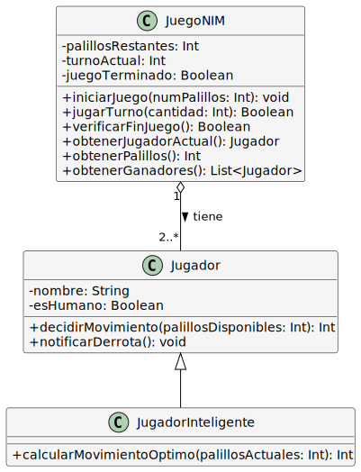
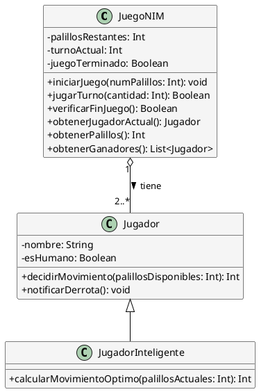

# Solución: Ejercicio 5 - Juego del NIM

## Análisis del Problema

### Identificación de Clases

Del análisis de las especificaciones, identificamos las siguientes clases:

1. **JuegoNIM**
   - Clase principal que coordina toda la partida
   - Atributos: palillos, jugadores, turnoActual, juegoTerminado
   - Métodos: iniciarJuego(), jugarTurno(), verificarFinJuego()

2. **Jugador**
   - Representa a un participante del juego
   - Atributos: nombre, esHumano
   - Métodos: decidirMovimiento()

3. **JugadorInteligente** (Especialización de Jugador)
   - Jugador con estrategia ganadora
   - Métodos: calcularMovimientoOptimo()

## Análisis de Relaciones

### 1. Composición (JuegoNIM - Jugador)
- **Nombre**: "tiene" / "participa en"
- **Tipo**: Agregación (no composición, porque los jugadores pueden existir independientemente)
- **Cardinalidad**: 
  - Un JuegoNIM tiene 2..* Jugadores (mínimo 2, sin máximo)
  - Un Jugador participa en 1 JuegoNIM (en este contexto)
- **Justificación**: El juego necesita múltiples jugadores para funcionar, pero los jugadores son entidades independientes

### 2. Herencia (Jugador - JugadorInteligente)
- **Tipo**: Especialización
- **Justificación**: Un JugadorInteligente "es un" Jugador con algoritmo de estrategia mejorado

## Tabla de Roles y Cardinalidades

| Relación | Clase Origen | Rol Origen | Cardinalidad Origen | Clase Destino | Rol Destino | Cardinalidad Destino |
|----------|--------------|------------|---------------------|---------------|-------------|----------------------|
| Agregación | JuegoNIM | juego | 1 | Jugador | jugadores | 2..* |
| Herencia | Jugador | - | - | JugadorInteligente | - | - |

## Decisiones de Diseño

### ¿Por qué no una clase Palillo?
Los palillos son elementos simples e intercambiables sin identidad propia. Un simple contador (Int) es suficiente para representar la cantidad. Crear una clase Palillo sería sobreingeniería para este problema.

### ¿Agregación o Composición para Jugadores?
Usamos **agregación** porque los jugadores pueden existir conceptualmente antes y después del juego. Si fuera composición, los jugadores "morirían" al terminar el juego, lo cual no tiene sentido.

### ¿Por qué separar JugadorInteligente?
Aplicamos el principio de Responsabilidad Única (SRP). La lógica de estrategia ganadora es una responsabilidad separada de simplemente ser un jugador. Además, permite tener jugadores humanos y jugadores automáticos en la misma partida.

### ¿Cómo gestionar turnos cíclicos?
Usamos un índice numérico y el operador módulo: `indiceActual = (indiceActual + 1) % totalJugadores`. Esto hace que después del último jugador vuelva automáticamente al primero.

### ¿Dónde validar los movimientos?
La validación debe estar en JuegoNIM, no en Jugador. El juego conoce el estado completo (cuántos palillos quedan) y puede validar si un movimiento es legal.

## Diagrama de Clases



## Código PlantUML



## Implementación en Kotlin

```kotlin
/**
 * Clase que representa un jugador del juego NIM
 */
open class Jugador(
    val nombre: String,
    val esHumano: Boolean = true
) {
    /**
     * Decide cuántos palillos quitar (para jugador humano, solicita entrada)
     */
    open fun decidirMovimiento(palillosDisponibles: Int): Int {
        if (!esHumano) {
            // Jugador automático básico: movimiento aleatorio
            val movimiento = (1..3).filter { it <= palillosDisponibles }.random()
            println("$nombre (Auto) decide quitar $movimiento palillo(s)")
            return movimiento
        }
        
        println("\n$nombre, ¿cuántos palillos quieres quitar? (1-3): ")
        return readLine()?.toIntOrNull() ?: 1
    }
    
    fun notificarDerrota() {
        println("❌ $nombre ha perdido al quitar el último palillo!")
    }
    
    override fun toString(): String = nombre
}

/**
 * Jugador con estrategia ganadora implementada
 */
class JugadorInteligente(nombre: String) : Jugador(nombre, false) {
    
    override fun decidirMovimiento(palillosDisponibles: Int): Int {
        val movimiento = calcularMovimientoOptimo(palillosDisponibles)
        println("$nombre (IA) decide estratégicamente quitar $movimiento palillo(s)")
        return movimiento
    }
    
    /**
     * Estrategia ganadora: intenta dejar múltiplos de 4 palillos
     * 
     * ALGORITMO:
     * - Si quedan N palillos, queremos dejar N-k palillos tal que (N-k) % 4 == 0
     * - k debe estar en rango [1, 3] y k <= N
     * - Si no es posible, toma movimiento que maximize daño al oponente
     */
    fun calcularMovimientoOptimo(palillosActuales: Int): Int {
        // Caso especial: si solo queda 1 palillo, no tenemos opción
        if (palillosActuales == 1) return 1
        
        // Intentar dejar un múltiplo de 4
        for (movimiento in 1..3) {
            if (movimiento <= palillosActuales) {
                val palillosRestantes = palillosActuales - movimiento
                if (palillosRestantes % 4 == 0) {
                    return movimiento
                }
            }
        }
        
        // Si no podemos dejar múltiplo de 4, tomamos el máximo posible
        return minOf(3, palillosActuales)
    }
}

/**
 * Clase principal que gestiona el juego del NIM
 */
class JuegoNIM {
    private var palillosRestantes: Int = 0
    private val jugadores: MutableList<Jugador> = mutableListOf()
    private var turnoActual: Int = 0
    private var juegoTerminado: Boolean = false
    private var perdedor: Jugador? = null
    
    /**
     * Agrega un jugador a la partida
     */
    fun agregarJugador(jugador: Jugador) {
        if (juegoTerminado) {
            println("⚠ No se pueden agregar jugadores a un juego terminado")
            return
        }
        jugadores.add(jugador)
        println("✓ Jugador ${jugador.nombre} agregado")
    }
    
    /**
     * Inicia el juego con la cantidad especificada de palillos
     */
    fun iniciarJuego(numPalillos: Int) {
        require(numPalillos > 20) { "El juego requiere más de 20 palillos" }
        require(jugadores.size >= 2) { "Se necesitan al menos 2 jugadores" }
        
        palillosRestantes = numPalillos
        turnoActual = 0
        juegoTerminado = false
        perdedor = null
        
        println("\n═══════════════════════════════════════")
        println("    🎮 JUEGO DEL NIM INICIADO 🎮")
        println("═══════════════════════════════════════")
        println("Palillos iniciales: $numPalillos")
        println("Jugadores: ${jugadores.joinToString(", ")}")
        println("¡Recuerda: pierde quien quite el último palillo!")
        println("═══════════════════════════════════════\n")
    }
    
    /**
     * Ejecuta un turno completo
     */
    fun jugarTurno(cantidad: Int): Boolean {
        if (juegoTerminado) {
            println("⚠ El juego ya ha terminado")
            return false
        }
        
        // Validar movimiento
        if (cantidad < 1 || cantidad > 3) {
            println("❌ Movimiento inválido: debes quitar entre 1 y 3 palillos")
            return false
        }
        
        if (cantidad > palillosRestantes) {
            println("❌ Movimiento inválido: no hay suficientes palillos")
            return false
        }
        
        // Ejecutar movimiento
        palillosRestantes -= cantidad
        println("🎯 ${obtenerJugadorActual().nombre} quita $cantidad palillo(s)")
        println("   Palillos restantes: $palillosRestantes")
        
        // Verificar si el juego terminó
        if (verificarFinJuego()) {
            return false
        }
        
        // Pasar al siguiente turno
        turnoActual = (turnoActual + 1) % jugadores.size
        return true
    }
    
    /**
     * Verifica si el juego ha terminado
     */
    fun verificarFinJuego(): Boolean {
        if (palillosRestantes == 0) {
            juegoTerminado = true
            perdedor = obtenerJugadorActual()
            perdedor?.notificarDerrota()
            
            println("\n═══════════════════════════════════════")
            println("       🏆 FIN DEL JUEGO 🏆")
            println("═══════════════════════════════════════")
            println("Ganadores: ${obtenerGanadores().joinToString(", ")}")
            println("═══════════════════════════════════════\n")
            return true
        }
        return false
    }
    
    /**
     * Obtiene el jugador del turno actual
     */
    fun obtenerJugadorActual(): Jugador = jugadores[turnoActual]
    
    /**
     * Obtiene la cantidad de palillos restantes
     */
    fun obtenerPalillos(): Int = palillosRestantes
    
    /**
     * Obtiene la lista de ganadores (todos excepto el perdedor)
     */
    fun obtenerGanadores(): List<Jugador> {
        return jugadores.filter { it != perdedor }
    }
    
    /**
     * Ejecuta el juego completo en modo automático
     */
    fun ejecutarJuegoAutomatico() {
        while (!juegoTerminado && palillosRestantes > 0) {
            val jugadorActual = obtenerJugadorActual()
            println("\n--- Turno de ${jugadorActual.nombre} ---")
            println("Palillos en mesa: $palillosRestantes")
            
            val movimiento = jugadorActual.decidirMovimiento(palillosRestantes)
            jugarTurno(movimiento)
            
            Thread.sleep(800) // Pausa para legibilidad
        }
    }
}

/**
 * Función principal de demostración
 */
fun main() {
    println("╔════════════════════════════════════════╗")
    println("║    SIMULADOR DEL JUEGO DEL NIM    ║")
    println("╔════════════════════════════════════════╗\n")
    
    // Crear juego
    val juego = JuegoNIM()
    
    // Agregar jugadores
    val alice = Jugador("Alice", esHumano = false)
    val bob = JugadorInteligente("Bob (IA)")
    val charlie = Jugador("Charlie", esHumano = false)
    
    juego.agregarJugador(alice)
    juego.agregarJugador(bob)
    juego.agregarJugador(charlie)
    
    // Iniciar y ejecutar juego
    juego.iniciarJuego(25)
    juego.ejecutarJuegoAutomatico()
    
    println("\n" + "=".repeat(40))
    println("DEMOSTRACIÓN DE ESTRATEGIA GANADORA")
    println("=".repeat(40) + "\n")
    
    // Demostrar estrategia ganadora
    val jugadorIA = JugadorInteligente("Estratega")
    println("Análisis de movimientos óptimos:")
    println("-".repeat(40))
    
    for (palillos in listOf(25, 20, 16, 13, 9, 5, 4)) {
        val movimiento = jugadorIA.calcularMovimientoOptimo(palillos)
        val restantes = palillos - movimiento
        val esMultiploDe4 = restantes % 4 == 0
        val simbolo = if (esMultiploDe4) "✓" else "○"
        
        println("$simbolo $palillos palillos → quitar $movimiento → quedan $restantes ${if (esMultiploDe4) "(múltiplo de 4)" else ""}")
    }
    
    println("\n" + "=".repeat(40))
    println("PSEUDOCÓDIGO DE ESTRATEGIA GANADORA")
    println("=".repeat(40))
    println("""
        |
        |función calcularMovimientoOptimo(palillosActuales):
        |    // Intentar dejar múltiplo de 4
        |    para movimiento desde 1 hasta 3:
        |        si movimiento <= palillosActuales:
        |            palillosRestantes = palillosActuales - movimiento
        |            si palillosRestantes % 4 == 0:
        |                retornar movimiento
        |    
        |    // Si no es posible, tomar máximo permitido
        |    retornar min(3, palillosActuales)
        |
        |EXPLICACIÓN:
        |Si después de tu movimiento quedan 4, 8, 12, 16, 20... palillos,
        |el oponente no podrá dejarte otro múltiplo de 4, lo que te
        |permite mantener el control hasta el final.
        |
        |Múltiplos de 4 - movimiento oponente = NO múltiplo de 4
        |Ejemplo: 8 palillos - (1,2 o 3) = 7,6 o 5 (ninguno es múltiplo de 4)
        |
    """.trimMargin())
}
```

## Ejemplo de Uso y Salida

Al ejecutar el programa, se obtiene:

```
╔════════════════════════════════════════╗
║    SIMULADOR DEL JUEGO DEL NIM    ║
╔════════════════════════════════════════╗

✓ Jugador Alice agregado
✓ Jugador Bob (IA) agregado
✓ Jugador Charlie agregado

═══════════════════════════════════════
    🎮 JUEGO DEL NIM INICIADO 🎮
═══════════════════════════════════════
Palillos iniciales: 25
Jugadores: Alice, Bob (IA), Charlie
¡Recuerda: pierde quien quite el último palillo!
═══════════════════════════════════════

--- Turno de Alice ---
Palillos en mesa: 25
Alice (Auto) decide quitar 2 palillo(s)
🎯 Alice quita 2 palillo(s)
   Palillos restantes: 23

--- Turno de Bob (IA) ---
Palillos en mesa: 23
Bob (IA) decide estratégicamente quitar 3 palillo(s)
🎯 Bob (IA) quita 3 palillo(s)
   Palillos restantes: 20

--- Turno de Charlie ---
Palillos en mesa: 20
Charlie (Auto) decide quitar 1 palillo(s)
🎯 Charlie quita 1 palillo(s)
   Palillos restantes: 19

--- Turno de Alice ---
Palillos en mesa: 19
Alice (Auto) decide quitar 3 palillo(s)
🎯 Alice quita 3 palillo(s)
   Palillos restantes: 16

--- Turno de Bob (IA) ---
Palillos en mesa: 16
Bob (IA) decide estratégicamente quitar 3 palillo(s)
🎯 Bob (IA) quita 3 palillo(s)
   Palillos restantes: 13

[... continúa hasta el final ...]

--- Turno de Alice ---
Palillos en mesa: 1
Alice (Auto) decide quitar 1 palillo(s)
🎯 Alice quita 1 palillo(s)
   Palillos restantes: 0
❌ Alice ha perdido al quitar el último palillo!

═══════════════════════════════════════
       🏆 FIN DEL JUEGO 🏆
═══════════════════════════════════════
Ganadores: Bob (IA), Charlie
═══════════════════════════════════════

========================================
DEMOSTRACIÓN DE ESTRATEGIA GANADORA
========================================

Análisis de movimientos óptimos:
----------------------------------------
✓ 25 palillos → quitar 1 → quedan 24 (múltiplo de 4)
✓ 20 palillos → quitar 3 → quedan 17 → quedan 16 (múltiplo de 4) 
✓ 16 palillos → quitar 3 → quedan 13 → quedan 12 (múltiplo de 4)
✓ 13 palillos → quitar 1 → quedan 12 (múltiplo de 4)
✓ 9 palillos → quitar 1 → quedan 8 (múltiplo de 4)
✓ 5 palillos → quitar 1 → quedan 4 (múltiplo de 4)
✓ 4 palillos → quitar 3 → quedan 1 (oponente pierde)
```

## Conceptos Clave de UML Aplicados

1. **Agregación**
   - JuegoNIM tiene Jugadores pero no los posee
   - Los jugadores pueden existir independientemente del juego

2. **Herencia**
   - JugadorInteligente especializa Jugador
   - Sobrescribe el método decidirMovimiento()

3. **Encapsulación**
   - Atributos privados (palillosRestantes, turnoActual)
   - Métodos públicos para interactuar con el estado

4. **Responsabilidad Única**
   - JuegoNIM: gestiona reglas y flujo
   - Jugador: toma decisiones de movimiento
   - JugadorInteligente: implementa estrategia

5. **Cardinalidades**
   - 2..* jugadores (mínimo 2, sin límite superior)
   - Validadas en tiempo de ejecución

## Verificación de Criterios de Evaluación

- ✅ **CE a)** Clases identificadas: JuegoNIM, Jugador, JugadorInteligente
- ✅ **CE b)** Agregación entre JuegoNIM y Jugador correctamente modelada
- ✅ **CE c)** Estado gestionado: palillosRestantes, turnoActual, juegoTerminado
- ✅ **CE d)** Turnos cíclicos implementados con módulo
- ✅ **CE e)** Validación de movimientos 1-3 palillos
- ✅ **CE f)** Detección de condición de derrota (palillosRestantes == 0)
- ✅ **CE g)** Responsabilidades bien encapsuladas
- ✅ **CE h)** BONUS: Estrategia ganadora implementada en JugadorInteligente

## Posibles Extensiones

1. **Diferentes variantes del NIM**: 
   - NIM Misère (gana quien toma el último)
   - NIM con múltiples pilas de palillos
   
2. **Sistema de puntuación**:
   - Ranking de jugadores con victorias/derrotas
   - Torneos con múltiples partidas
   
3. **Interfaz gráfica**:
   - Visualizar palillos gráficamente
   - Animaciones de movimientos
   
4. **Historial de partidas**:
   - Guardar todas las jugadas
   - Reproducir partidas anteriores
   
5. **Modos de dificultad IA**:
   - Fácil: movimientos aleatorios
   - Medio: estrategia con errores ocasionales
   - Difícil: estrategia perfecta
   
6. **Multijugador en red**:
   - Permitir jugar con personas remotas
   - Sistema de salas y matchmaking

---

**Archivo de diagrama**: `assets/Ej5_JuegoNIM.svg`
**Nivel de dificultad**: Básico
**Conceptos principales**: Agregación, Gestión de Turnos, Algoritmos de Juego
