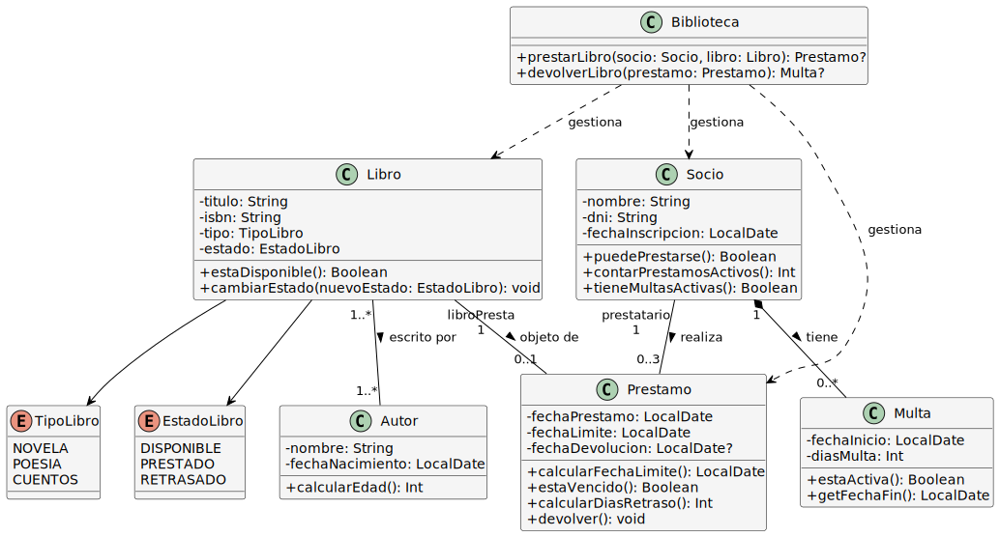
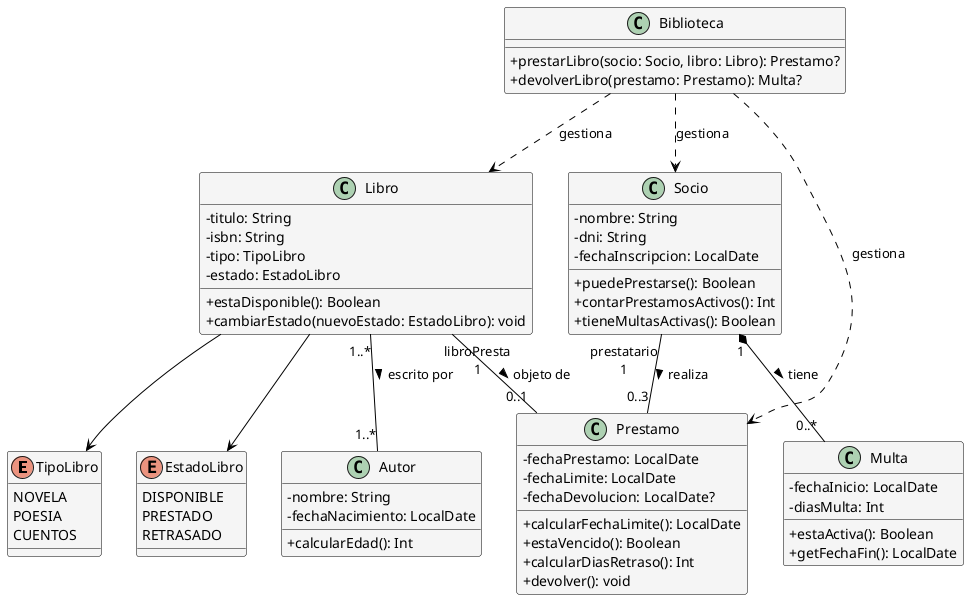

# Solución: Ejercicio 6 - Sistema de Biblioteca

## Análisis del Problema

### Identificación de Clases

Del análisis de las especificaciones, identificamos las siguientes clases:

1. **Libro**
   - Representa un ejemplar físico en la biblioteca
   - Atributos: titulo, isbn, tipo, estado
   - Métodos: cambiarEstado(), estaDisponible()

2. **TipoLibro** (Enumeración)
   - Valores: NOVELA, POESIA, CUENTOS

3. **EstadoLibro** (Enumeración)
   - Valores: DISPONIBLE, PRESTADO, RETRASADO

4. **Autor**
   - Representa al escritor de libros
   - Atributos: nombre, fechaNacimiento
   - Métodos: calcularEdad()

5. **Socio**
   - Representa a un lector registrado
   - Atributos: nombre, dni, fechaInscripcion
   - Métodos: puedePrestarse(), tienePrestamosActivos()

6. **Prestamo** (Clase de Asociación)
   - Relaciona Socio con Libro
   - Atributos: fechaPrestamo, fechaLimite, fechaDevolucion
   - Métodos: calcularFechaLimite(), estaVencido(), calcularDiasRetraso()

7. **Multa**
   - Penalización por devolución tardía
   - Atributos: fechaInicio, diasMulta
   - Métodos: estaActiva()

## Análisis de Relaciones

### 1. Asociación (Libro - Autor)
- **Tipo**: Asociación N:M (un libro puede tener múltiples autores, un autor puede escribir múltiples libros)
- **Cardinalidad**: 1..* (libro) ↔ 1..* (autor)
- **Justificación**: Permite manejar coautoría

### 2. Clase de Asociación (Socio - Libro = Préstamo)
- **Tipo**: Clase de asociación con atributos propios
- **Cardinalidad**: 
  - Un Socio puede tener 0..3 Préstamos activos
  - Un Libro puede estar en 0..1 Préstamo activo
- **Justificación**: El préstamo tiene información propia (fechas) que no pertenece ni al socio ni al libro

### 3. Composición (Socio - Multa)
- **Tipo**: Composición (la multa no existe sin el socio)
- **Cardinalidad**: Un Socio tiene 0..* Multas
- **Justificación**: Las multas pertenecen exclusivamente a un socio

## Tabla de Roles y Cardinalidades

| Relación | Clase Origen | Rol Origen | Cardinalidad Origen | Clase Destino | Rol Destino | Cardinalidad Destino |
|----------|--------------|------------|---------------------|---------------|-------------|----------------------|
| Asociación | Libro | librosEscritos | 1..* | Autor | autores | 1..* |
| Clase Asociación | Socio | prestatario | 1 | Libro | libroPrestad| 1 |
| (Préstamo) | | | 0..3 activos | | | 0..1 activo |
| Composición | Socio | socioMultado | 1 | Multa | multas | 0..* |
| Dependencia | Libro | - | - | TipoLibro | tipo | 1 |
| Dependencia | Libro | - | - | EstadoLibro | estado | 1 |

## Decisiones de Diseño

### ¿Por qué una clase Préstamo separada?
El préstamo no es solo una relación, tiene información propia (fechas, estado). Es un concepto del dominio con ciclo de vida propio. Una clase de asociación es la forma correcta de modelarlo.

### ¿Por qué Multa como composición?
Una multa no tiene sentido sin un socio. Si eliminamos al socio, sus multas también desaparecen. Es una composición clara.

### ¿Libro-Autor: agregación o asociación?
Usamos asociación simple N:M porque ambos pueden existir independientemente. Un autor existe aunque no tenga libros en la biblioteca, y un libro existe aunque su autor no esté registrado (podría tener solo el nombre).

### ¿Cómo gestionar el límite de 3 préstamos?
Validación en el método `puedePrestarse()` del Socio que cuenta préstamos activos (sin fechaDevolucion).

### ¿Cómo calcular días de multa?
Fórmula: `diasMulta = diasRetraso × 3`, donde `diasRetraso = fechaDevolucion - fechaLimite` si es positivo.

## Diagrama de Clases



## Código PlantUML



## Implementación en Kotlin

```kotlin
import java.time.LocalDate
import java.time.Period
import java.time.temporal.ChronoUnit

/**
 * Enumeración para tipos de libros
 */
enum class TipoLibro {
    NOVELA, POESIA, CUENTOS
}

/**
 * Enumeración para estados de libros
 */
enum class EstadoLibro {
    DISPONIBLE, PRESTADO, RETRASADO
}

/**
 * Clase que representa un autor
 */
class Autor(
    val nombre: String,
    private val fechaNacimiento: LocalDate
) {
    fun calcularEdad(): Int {
        return Period.between(fechaNacimiento, LocalDate.now()).years
    }
    
    override fun toString(): String = "$nombre (${calcularEdad()} años)"
}

/**
 * Clase que representa un libro
 */
class Libro(
    val titulo: String,
    val isbn: String,
    val tipo: TipoLibro,
    private val autores: MutableList<Autor> = mutableListOf()
) {
    var estado: EstadoLibro = EstadoLibro.DISPONIBLE
        private set
    
    fun agregarAutor(autor: Autor) {
        if (autor !in autores) {
            autores.add(autor)
        }
    }
    
    fun estaDisponible(): Boolean = estado == EstadoLibro.DISPONIBLE
    
    fun cambiarEstado(nuevoEstado: EstadoLibro) {
        estado = nuevoEstado
    }
    
    fun getAutores(): List<Autor> = autores.toList()
    
    override fun toString(): String {
        return "\"$titulo\" [${tipo}] - ${autores.joinToString(", ")} - Estado: $estado"
    }
}

/**
 * Clase que representa una multa
 */
class Multa(
    val fechaInicio: LocalDate,
    val diasMulta: Int
) {
    fun estaActiva(): Boolean {
        val fechaFin = getFechaFin()
        return LocalDate.now().isBefore(fechaFin) || LocalDate.now().isEqual(fechaFin)
    }
    
    fun getFechaFin(): LocalDate {
        return fechaInicio.plusDays(diasMulta.toLong())
    }
    
    fun diasRestantes(): Long {
        return ChronoUnit.DAYS.between(LocalDate.now(), getFechaFin()).coerceAtLeast(0)
    }
    
    override fun toString(): String {
        return if (estaActiva()) {
            "Multa activa: $diasMulta días (quedan ${diasRestantes()} días)"
        } else {
            "Multa cumplida: $diasMulta días"
        }
    }
}

/**
 * Clase que representa un socio
 */
class Socio(
    val nombre: String,
    val dni: String,
    val fechaInscripcion: LocalDate
) {
    private val prestamos: MutableList<Prestamo> = mutableListOf()
    private val multas: MutableList<Multa> = mutableListOf()
    
    fun agregarPrestamo(prestamo: Prestamo) {
        prestamos.add(prestamo)
    }
    
    fun agregarMulta(multa: Multa) {
        multas.add(multa)
        println("⚠️  Multa generada para $nombre: ${multa.diasMulta} días")
    }
    
    fun contarPrestamosActivos(): Int {
        return prestamos.count { it.fechaDevolucion == null }
    }
    
    fun tieneMultasActivas(): Boolean {
        return multas.any { it.estaActiva() }
    }
    
    fun puedePrestarse(): Boolean {
        return !tieneMultasActivas() && contarPrestamosActivos() < 3
    }
    
    fun getMultasActivas(): List<Multa> {
        return multas.filter { it.estaActiva() }
    }
    
    override fun toString(): String {
        return "Socio: $nombre (DNI: $dni) - Préstamos activos: ${contarPrestamosActivos()}/3 - Multas: ${getMultasActivas().size}"
    }
}

/**
 * Clase de asociación que representa un préstamo
 */
class Prestamo(
    val socio: Socio,
    val libro: Libro,
    val fechaPrestamo: LocalDate = LocalDate.now()
) {
    val fechaLimite: LocalDate = calcularFechaLimite()
    var fechaDevolucion: LocalDate? = null
        private set
    
    private fun calcularFechaLimite(): LocalDate {
        return fechaPrestamo.plusDays(30)
    }
    
    fun estaVencido(): Boolean {
        return LocalDate.now().isAfter(fechaLimite) && fechaDevolucion == null
    }
    
    fun calcularDiasRetraso(): Int {
        val fechaReal = fechaDevolucion ?: LocalDate.now()
        val dias = ChronoUnit.DAYS.between(fechaLimite, fechaReal).toInt()
        return dias.coerceAtLeast(0)
    }
    
    fun devolver(): Multa? {
        if (fechaDevolucion != null) {
            println("❌ Este préstamo ya fue devuelto")
            return null
        }
        
        fechaDevolucion = LocalDate.now()
        
        val diasRetraso = calcularDiasRetraso()
        return if (diasRetraso > 0) {
            libro.cambiarEstado(EstadoLibro.DISPONIBLE)
            val diasMulta = diasRetraso * 3
            Multa(LocalDate.now(), diasMulta)
        } else {
            libro.cambiarEstado(EstadoLibro.DISPONIBLE)
            null
        }
    }
    
    override fun toString(): String {
        val estado = if (fechaDevolucion != null) {
            "Devuelto el ${fechaDevolucion}"
        } else if (estaVencido()) {
            "¡RETRASADO! (${calcularDiasRetraso()} días)"
        } else {
            "Activo (límite: $fechaLimite)"
        }
        return "Préstamo: ${libro.titulo} → ${socio.nombre} - $estado"
    }
}

/**
 * Clase gestora de la biblioteca
 */
class Biblioteca {
    private val libros: MutableList<Libro> = mutableListOf()
    private val socios: MutableList<Socio> = mutableListOf()
    private val prestamos: MutableList<Prestamo> = mutableListOf()
    
    fun registrarLibro(libro: Libro) {
        libros.add(libro)
        println("✓ Libro registrado: ${libro.titulo}")
    }
    
    fun registrarSocio(socio: Socio) {
        socios.add(socio)
        println("✓ Socio registrado: ${socio.nombre}")
    }
    
    /**
     * Presta un libro a un socio con todas las validaciones
     */
    fun prestarLibro(socio: Socio, libro: Libro): Prestamo? {
        // Validaciones
        if (!libro.estaDisponible()) {
            println("❌ El libro no está disponible (Estado: ${libro.estado})")
            return null
        }
        
        if (!socio.puedePrestarse()) {
            if (socio.tieneMultasActivas()) {
                println("❌ ${socio.nombre} tiene multas activas:")
                socio.getMultasActivas().forEach { println("   - $it") }
            } else {
                println("❌ ${socio.nombre} ya tiene 3 libros prestados")
            }
            return null
        }
        
        // Crear préstamo
        val prestamo = Prestamo(socio, libro)
        prestamos.add(prestamo)
        socio.agregarPrestamo(prestamo)
        libro.cambiarEstado(EstadoLibro.PRESTADO)
        
        println("✓ Préstamo realizado:")
        println("  Libro: ${libro.titulo}")
        println("  Socio: ${socio.nombre}")
        println("  Fecha límite: ${prestamo.fechaLimite}")
        
        return prestamo
    }
    
    /**
     * Devuelve un libro y genera multa si hay retraso
     */
    fun devolverLibro(prestamo: Prestamo): Multa? {
        val multa = prestamo.devolver()
        
        if (multa != null) {
            prestamo.socio.agregarMulta(multa)
            prestamo.libro.cambiarEstado(EstadoLibro.DISPONIBLE)
            println("✓ Libro devuelto con retraso de ${prestamo.calcularDiasRetraso()} días")
        } else {
            prestamo.libro.cambiarEstado(EstadoLibro.DISPONIBLE)
            println("✓ Libro devuelto a tiempo")
        }
        
        return multa
    }
    
    fun listarPrestamosActivos() {
        val activos = prestamos.filter { it.fechaDevolucion == null }
        println("\n--- PRÉSTAMOS ACTIVOS (${activos.size}) ---")
        activos.forEach { println(it) }
    }
}

/**
 * Función principal de demostración
 */
fun main() {
    println("╔═══════════════════════════════════════════╗")
    println("║   SISTEMA DE GESTIÓN DE BIBLIOTECA    ║")
    println("╚═══════════════════════════════════════════╝\n")
    
    val biblioteca = Biblioteca()
    
    // Registrar autores
    val cervantes = Autor("Miguel de Cervantes", LocalDate.of(1547, 9, 29))
    val garciaLorca = Autor("Federico García Lorca", LocalDate.of(1898, 6, 5))
    val jimenez = Autor("Juan Ramón Jiménez", LocalDate.of(1881, 12, 23))
    
    // Registrar libros
    val quijote = Libro("Don Quijote de la Mancha", "978-84-376-0494-7", TipoLibro.NOVELA)
    quijote.agregarAutor(cervantes)
    
    val romancero = Libro("Romancero Gitano", "978-84-376-0123-6", TipoLibro.POESIA)
    romancero.agregarAutor(garciaLorca)
    
    val platero = Libro("Platero y yo", "978-84-376-0876-1", TipoLibro.CUENTOS)
    platero.agregarAutor(jimenez)
    
    biblioteca.registrarLibro(quijote)
    biblioteca.registrarLibro(romancero)
    biblioteca.registrarLibro(platero)
    println()
    
    // Registrar socios
    val maria = Socio("María González", "12345678A", LocalDate.of(2020, 1, 15))
    val juan = Socio("Juan Pérez", "87654321B", LocalDate.of(2019, 5, 20))
    
    biblioteca.registrarSocio(maria)
    biblioteca.registrarSocio(juan)
    println()
    
    // Escenario 1: Préstamos normales
    println("=== ESCENARIO 1: Préstamos Normales ===\n")
    val prestamo1 = biblioteca.prestarLibro(maria, quijote)
    println()
    val prestamo2 = biblioteca.prestarLibro(juan, romancero)
    println()
    
    // Escenario 2: Intentar exceder el límite
    println("\n=== ESCENARIO 2: Límite de 3 Libros ===\n")
    val libro4 = Libro("Libro Temporal 1", "111", TipoLibro.NOVELA)
    val libro5 = Libro("Libro Temporal 2", "222", TipoLibro.NOVELA)
    val libro6 = Libro("Libro Temporal 3", "333", TipoLibro.NOVELA)
    val libro7 = Libro("Libro Temporal 4", "444", TipoLibro.NOVELA)
    
    listOf(libro4, libro5, libro6, libro7).forEach { biblioteca.registrarLibro(it) }
    println()
    
    biblioteca.prestarLibro(maria, libro4)
    println()
    biblioteca.prestarLibro(maria, libro5)
    println()
    biblioteca.prestarLibro(maria, libro6) // Debe fallar - ya tiene 3
    println()
    
    // Escenario 3: Devolución con retraso
    println("\n=== ESCENARIO 3: Devolución con Retraso ===\n")
    val prestamoRetrasado = Prestamo(
        juan,
        platero,
        LocalDate.now().minusDays(35) // Prestado hace 35 días (5 días de retraso)
    )
    juan.agregarPrestamo(prestamoRetrasado)
    platero.cambiarEstado(EstadoLibro.PRESTADO)
    
    println("Simulando préstamo antiguo:")
    println(prestamoRetrasado)
    println()
    
    biblioteca.devolverLibro(prestamoRetrasado)
    println()
    
    // Verificar multa
    println("--- Estado de Juan después de devolución tardía ---")
    println(juan)
    juan.getMultasActivas().forEach { println("  $it") }
    println()
    
    // Escenario 4: Intentar prestar con multa activa
    println("\n=== ESCENARIO 4: Préstamo con Multa Activa ===\n")
    biblioteca.prestarLibro(juan, platero) // Debe fallar
    println()
    
    // Listar estado final
    println("\n=== ESTADO FINAL ===\n")
    biblioteca.listarPrestamosActivos()
    println()
    println("--- Socios ---")
    println(maria)
    println(juan)
}
```

## Ejemplo de Uso y Salida

```
╔═══════════════════════════════════════════╗
║   SISTEMA DE GESTIÓN DE BIBLIOTECA    ║
╚═══════════════════════════════════════════╝

✓ Libro registrado: Don Quijote de la Mancha
✓ Libro registrado: Romancero Gitano
✓ Libro registrado: Platero y yo

✓ Socio registrado: María González
✓ Socio registrado: Juan Pérez

=== ESCENARIO 1: Préstamos Normales ===

✓ Préstamo realizado:
  Libro: Don Quijote de la Mancha
  Socio: María González
  Fecha límite: 2025-12-25

✓ Préstamo realizado:
  Libro: Romancero Gitano
  Socio: Juan Pérez
  Fecha límite: 2025-12-25

=== ESCENARIO 2: Límite de 3 Libros ===

✓ Libro registrado: Libro Temporal 1
✓ Libro registrado: Libro Temporal 2
✓ Libro registrado: Libro Temporal 3
✓ Libro registrado: Libro Temporal 4

✓ Préstamo realizado:
  Libro: Libro Temporal 1
  Socio: María González
  Fecha límite: 2025-12-25

✓ Préstamo realizado:
  Libro: Libro Temporal 2
  Socio: María González
  Fecha límite: 2025-12-25

❌ María González ya tiene 3 libros prestados

=== ESCENARIO 3: Devolución con Retraso ===

Simulando préstamo antiguo:
Préstamo: Platero y yo → Juan Pérez - ¡RETRASADO! (5 días)

⚠️  Multa generada para Juan Pérez: 15 días
✓ Libro devuelto con retraso de 5 días

--- Estado de Juan después de devolución tardía ---
Socio: Juan Pérez (DNI: 87654321B) - Préstamos activos: 1/3 - Multas: 1
  Multa activa: 15 días (quedan 15 días)

=== ESCENARIO 4: Préstamo con Multa Activa ===

❌ Juan Pérez tiene multas activas:
   - Multa activa: 15 días (quedan 15 días)

=== ESTADO FINAL ===

--- PRÉSTAMOS ACTIVOS (3) ---
Préstamo: Don Quijote de la Mancha → María González - Activo (límite: 2025-12-25)
Préstamo: Romancero Gitano → Juan Pérez - Activo (límite: 2025-12-25)
Préstamo: Libro Temporal 1 → María González - Activo (límite: 2025-12-25)

--- Socios ---
Socio: María González (DNI: 12345678A) - Préstamos activos: 3/3 - Multas: 0
Socio: Juan Pérez (DNI: 87654321B) - Préstamos activos: 1/3 - Multas: 1
```

## Conceptos Clave de UML Aplicados

1. **Enumeraciones**
   - TipoLibro y EstadoLibro como tipos restringidos
   - Previene valores inválidos

2. **Clase de Asociación**
   - Préstamo relaciona Socio y Libro con atributos propios
   - Modela relaciones temporales con datos

3. **Composición**
   - Multa compuesta en Socio
   - Ciclo de vida dependiente

4. **Asociación N:M**
   - Libro-Autor permite coautoría
   - Navegabilidad bidireccional

5. **Reglas de Negocio**
   - Límite de 3 préstamos validado en código
   - Cálculo automático de multas (3 días × retraso)

6. **Atributos Derivados**
   - FechaLimite calculada (fechaPrestamo + 30)
   - Edad del autor calculada
   - Días de retraso calculados

## Verificación de Criterios de Evaluación

- ✅ **CE a)** Clases identificadas: Libro, Autor, Socio, Préstamo, Multa, Biblioteca
- ✅ **CE b)** Enumeraciones: TipoLibro, EstadoLibro
- ✅ **CE c)** Relación Libro-Autor como asociación N:M
- ✅ **CE d)** Préstamo como clase de asociación
- ✅ **CE e)** Reglas implementadas: límite 3 libros, multas activas
- ✅ **CE f)** Atributos derivados calculados dinámicamente
- ✅ **CE g)** Validaciones completas en prestar/devolver
- ✅ **CE h)** Estados gestionados correctamente

## Posibles Extensiones

1. **Reservas**: Permitir reservar libros prestados
2. **Renovaciones**: Extender plazo de préstamo si no hay reservas
3. **Historial**: Mantener registro de todos los préstamos
4. **Categorías**: Clasificar socios (infantil, adulto, estudiante)
5. **Ubicación**: Añadir estantería y posición física del libro
6. **Notificaciones**: Sistema de recordatorios de devolución
7. **Búsqueda avanzada**: Por autor, género, disponibilidad

---

**Archivo de diagrama**: `assets/Ej6_Biblioteca.svg`
**Nivel de dificultad**: Básico-Intermedio
**Conceptos principales**: Clase de Asociación, Enumeraciones, Reglas de Negocio
