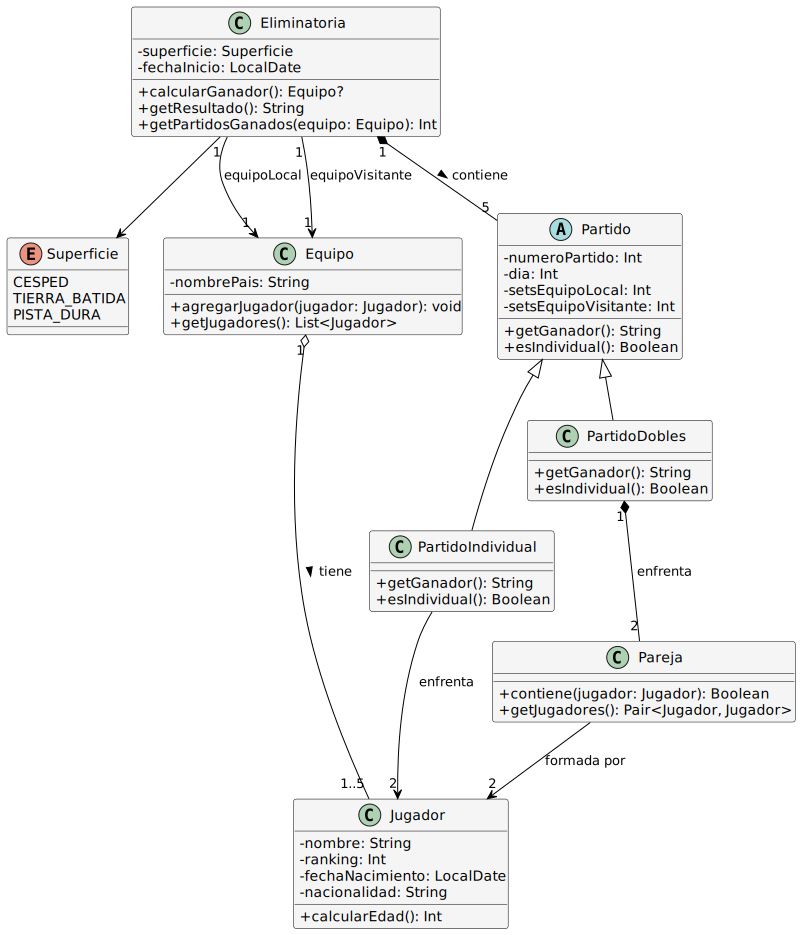
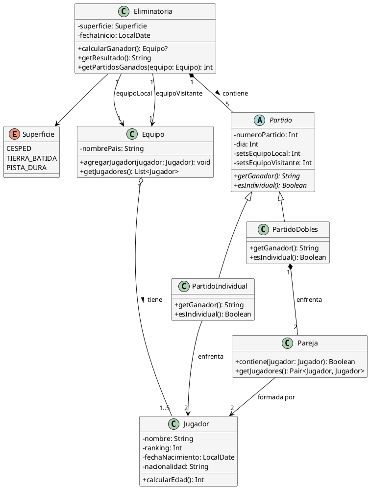

# Solución: Ejercicio 7 - Copa Davis de Tenis

## Análisis del Problema

### Identificación de Clases

Del análisis de las especificaciones, identificamos las siguientes clases:

1. **Equipo**
   - Representa a un país participante
   - Atributos: nombrePais
   - Métodos: agregarJugador(), getJugadores()

2. **Jugador**
   - Representa a un tenista
   - Atributos: nombre, ranking, fechaNacimiento, nacionalidad
   - Métodos: calcularEdad()

3. **Eliminatoria**
   - Representa un enfrentamiento entre dos equipos
   - Atributos: equipoLocal, equipoVisitante, superficie, fechaInicio
   - Métodos: calcularGanador(), getResultado()

4. **Superficie** (Enumeración)
   - Valores: CESPED, TIERRA_BATIDA, PISTA_DURA

5. **Partido** (Clase Abstracta)
   - Base para todos los tipos de partidos
   - Atributos: numeroPartido, dia, setsEquipoLocal, setsEquipoVisitante
   - Métodos abstractos: getGanador(), esIndividual()

6. **PartidoIndividual** (Especialización de Partido)
   - Partido uno contra uno
   - Atributos: jugadorLocal, jugadorVisitante
   - Métodos: getGanador()

7. **PartidoDobles** (Especialización de Partido)
   - Partido de parejas
   - Atributos: pareja1, pareja2
   - Métodos: getGanador()

8. **Pareja**
   - Dupla de jugadores para dobles
   - Atributos: jugador1, jugador2
   - Métodos: contiene(jugador)

## Análisis de Relaciones

### 1. Asociación (Equipo - Jugador)
- **Tipo**: Asociación N:M con restricción
- **Cardinalidad**: 
  - Un Equipo tiene 1..5 Jugadores (en una eliminatoria específica)
  - Un Jugador pertenece a 1 Equipo (en una eliminatoria)
- **Justificación**: Los jugadores pueden cambiar de equipo entre competiciones

### 2. Composición (Eliminatoria - Partido)
- **Tipo**: Composición fuerte
- **Cardinalidad**: Una Eliminatoria contiene exactamente 5 Partidos
- **Justificación**: Los partidos no existen sin la eliminatoria

### 3. Herencia (Partido → PartidoIndividual / PartidoDobles)
- **Tipo**: Herencia con clase abstracta
- **Justificación**: Ambos tipos de partido comparten atributos base pero difieren en participantes

### 4. Asociación (Eliminatoria - Equipo)
- **Tipo**: Asociación binaria con roles
- **Cardinalidad**: Una Eliminatoria enfrenta a 2 Equipos (local y visitante)
- **Roles**: equipoLocal (anfitrión) y equipoVisitante

### 5. Composición (PartidoDobles - Pareja)
- **Tipo**: Composición
- **Cardinalidad**: Un PartidoDobles tiene 2 Parejas
- **Justificación**: Las parejas son específicas de cada partido de dobles

## Tabla de Roles y Cardinalidades

| Relación | Clase Origen | Rol Origen | Cardinalidad Origen | Clase Destino | Rol Destino | Cardinalidad Destino |
|----------|--------------|------------|---------------------|---------------|-------------|----------------------|
| Asociación | Equipo | equipo | 1 | Jugador | jugadores | 1..5 |
| Composición | Eliminatoria | eliminatoria | 1 | Partido | partidos | 5 |
| Asociación | Eliminatoria | eliminatoria | 1 | Equipo | equipoLocal | 1 |
| Asociación | Eliminatoria | eliminatoria | 1 | Equipo | equipoVisitante | 1 |
| Herencia | Partido | - | - | PartidoIndividual | - | - |
| Herencia | Partido | - | - | PartidoDobles | - | - |
| Asociación | PartidoIndividual | partido | 1 | Jugador | jugadorLocal | 1 |
| Asociación | PartidoIndividual | partido | 1 | Jugador | jugadorVisitante | 1 |
| Composición | PartidoDobles | partido | 1 | Pareja | parejas | 2 |
| Asociación | Pareja | pareja | 1 | Jugador | jugadores | 2 |

## Decisiones de Diseño

### ¿Por qué Partido es abstracta?
Un partido siempre es individual o dobles, nunca "partido genérico". La clase abstracta define comportamiento común (resultado, sets) pero delega la lógica específica a las subclases.

### ¿Pareja como clase separada o solo referencia?
Creamos clase Pareja porque:
- Tiene identidad propia en el contexto del partido
- Facilita validaciones (dos jugadores del mismo equipo)
- Permite reutilización en múltiples partidos de dobles

### ¿Cómo modelar roles local/visitante?
Usamos dos asociaciones separadas desde Eliminatoria a Equipo con roles distintos. El equipo local tiene ventaja (elige superficie).

### ¿Cómo validar máximo 5 jugadores?
Validación en el método `agregarJugador()` de Equipo. Lanza excepción si se intenta agregar el sexto jugador.

### ¿Cómo garantizar al menos 2 jugadores diferentes en individuales?
Validación al crear los 4 PartidoIndividual. El sistema debe verificar que no se repita el mismo jugador en los 4 partidos.

### ¿Cómo calcular ganador de eliminatoria?
Método que recorre los 5 partidos, cuenta victorias por equipo. El que llega a 3 o más gana.

## Diagrama de Clases



## Código PlantUML



## Implementación en Kotlin

```kotlin
import java.time.LocalDate
import java.time.Period

/**
 * Enumeración para tipos de superficie
 */
enum class Superficie {
    CESPED, TIERRA_BATIDA, PISTA_DURA
}

/**
 * Clase que representa un jugador de tenis
 */
class Jugador(
    val nombre: String,
    val ranking: Int,
    private val fechaNacimiento: LocalDate,
    val nacionalidad: String
) {
    fun calcularEdad(): Int {
        return Period.between(fechaNacimiento, LocalDate.now()).years
    }
    
    override fun toString(): String = "$nombre (#$ranking, $nacionalidad)"
    
    override fun equals(other: Any?): Boolean {
        if (this === other) return true
        if (other !is Jugador) return false
        return nombre == other.nombre && nacionalidad == other.nacionalidad
    }
    
    override fun hashCode(): Int {
        return nombre.hashCode() * 31 + nacionalidad.hashCode()
    }
}

/**
 * Clase que representa un equipo nacional
 */
class Equipo(
    val nombrePais: String
) {
    private val jugadores: MutableList<Jugador> = mutableListOf()
    
    fun agregarJugador(jugador: Jugador) {
        require(jugadores.size < 5) { "Un equipo no puede tener más de 5 jugadores" }
        require(jugador.nacionalidad == nombrePais) { 
            "El jugador debe ser de $nombrePais, pero es de ${jugador.nacionalidad}" 
        }
        
        if (jugador !in jugadores) {
            jugadores.add(jugador)
            println("  ✓ ${jugador.nombre} agregado al equipo $nombrePais")
        }
    }
    
    fun getJugadores(): List<Jugador> = jugadores.toList()
    
    override fun toString(): String = "Equipo $nombrePais (${jugadores.size} jugadores)"
}

/**
 * Clase abstracta base para todos los partidos
 */
abstract class Partido(
    val numeroPartido: Int,
    val dia: Int
) {
    var setsEquipoLocal: Int = 0
        protected set
    var setsEquipoVisitante: Int = 0
        protected set
    
    abstract fun getGanador(): String
    abstract fun esIndividual(): Boolean
    
    fun registrarResultado(setsLocal: Int, setsVisitante: Int) {
        require(setsLocal >= 0 && setsVisitante >= 0) { "Los sets deben ser no negativos" }
        require(setsLocal != setsVisitante) { "Debe haber un ganador" }
        require(setsLocal == 3 || setsVisitante == 3) { "Se juega al mejor de 5 sets" }
        
        setsEquipoLocal = setsLocal
        setsEquipoVisitante = setsVisitante
    }
    
    fun ganaEquipoLocal(): Boolean = setsEquipoLocal > setsEquipoVisitante
    
    override fun toString(): String {
        val tipo = if (esIndividual()) "Individual" else "Dobles"
        val resultado = if (setsEquipoLocal == 0 && setsEquipoVisitante == 0) {
            "Sin jugar"
        } else {
            "$setsEquipoLocal-$setsEquipoVisitante (Gana: ${getGanador()})"
        }
        return "Partido $numeroPartido ($tipo, Día $dia): $resultado"
    }
}

/**
 * Partido individual (1 vs 1)
 */
class PartidoIndividual(
    numeroPartido: Int,
    dia: Int,
    val jugadorLocal: Jugador,
    val jugadorVisitante: Jugador
) : Partido(numeroPartido, dia) {
    
    override fun getGanador(): String {
        return if (ganaEquipoLocal()) jugadorLocal.nombre else jugadorVisitante.nombre
    }
    
    override fun esIndividual(): Boolean = true
    
    override fun toString(): String {
        return super.toString() + " [${jugadorLocal.nombre} vs ${jugadorVisitante.nombre}]"
    }
}

/**
 * Clase que representa una pareja de dobles
 */
class Pareja(
    private val jugador1: Jugador,
    private val jugador2: Jugador
) {
    init {
        require(jugador1 != jugador2) { "Los jugadores deben ser diferentes" }
        require(jugador1.nacionalidad == jugador2.nacionalidad) { 
            "Los jugadores de una pareja deben ser de la misma nacionalidad" 
        }
    }
    
    fun contiene(jugador: Jugador): Boolean {
        return jugador == jugador1 || jugador == jugador2
    }
    
    fun getJugadores(): Pair<Jugador, Jugador> = Pair(jugador1, jugador2)
    
    override fun toString(): String = "${jugador1.nombre} / ${jugador2.nombre}"
}

/**
 * Partido de dobles (pareja vs pareja)
 */
class PartidoDobles(
    numeroPartido: Int,
    dia: Int,
    val parejaLocal: Pareja,
    val parejaVisitante: Pareja
) : Partido(numeroPartido, dia) {
    
    override fun getGanador(): String {
        return if (ganaEquipoLocal()) parejaLocal.toString() else parejaVisitante.toString()
    }
    
    override fun esIndividual(): Boolean = false
    
    override fun toString(): String {
        return super.toString() + " [$parejaLocal vs $parejaVisitante]"
    }
}

/**
 * Clase que representa una eliminatoria completa
 */
class Eliminatoria(
    val equipoLocal: Equipo,
    val equipoVisitante: Equipo,
    val superficie: Superficie,
    val fechaInicio: LocalDate = LocalDate.now()
) {
    private val partidos: MutableList<Partido> = mutableListOf()
    
    init {
        println("\n╔═══════════════════════════════════════════════════╗")
        println("║      ELIMINATORIA COPA DAVIS              ║")
        println("╚═══════════════════════════════════════════════════╝")
        println("${equipoLocal.nombrePais} (Local) vs ${equipoVisitante.nombrePais} (Visitante)")
        println("Superficie: $superficie")
        println("Fecha: $fechaInicio")
        println()
    }
    
    fun agregarPartido(partido: Partido) {
        require(partidos.size < 5) { "Una eliminatoria tiene exactamente 5 partidos" }
        partidos.add(partido)
    }
    
    fun getPartidosGanados(equipo: Equipo): Int {
        return partidos.count { partido ->
            when {
                partido.setsEquipoLocal == 0 && partido.setsEquipoVisitante == 0 -> false
                equipo == equipoLocal -> partido.ganaEquipoLocal()
                equipo == equipoVisitante -> !partido.ganaEquipoLocal()
                else -> false
            }
        }
    }
    
    fun calcularGanador(): Equipo? {
        val partidosJugados = partidos.count { it.setsEquipoLocal > 0 || it.setsEquipoVisitante > 0 }
        if (partidosJugados < 5) {
            val victoriasLocal = getPartidosGanados(equipoLocal)
            val victoriasVisitante = getPartidosGanados(equipoVisitante)
            
            if (victoriasLocal >= 3) return equipoLocal
            if (victoriasVisitante >= 3) return equipoVisitante
            return null // Aún en curso
        }
        
        val victoriasLocal = getPartidosGanados(equipoLocal)
        return if (victoriasLocal >= 3) equipoLocal else equipoVisitante
    }
    
    fun getResultado(): String {
        val victoriasLocal = getPartidosGanados(equipoLocal)
        val victoriasVisitante = getPartidosGanados(equipoVisitante)
        return "${equipoLocal.nombrePais} $victoriasLocal - $victoriasVisitante ${equipoVisitante.nombrePais}"
    }
    
    fun mostrarResumen() {
        println("\n" + "═".repeat(60))
        println("RESUMEN DE LA ELIMINATORIA")
        println("═".repeat(60))
        println("Resultado: ${getResultado()}")
        
        val ganador = calcularGanador()
        if (ganador != null) {
            println("🏆 GANADOR: ${ganador.nombrePais}")
        } else {
            println("⏳ Eliminatoria en curso")
        }
        
        println("\nDETALLE DE PARTIDOS:")
        partidos.forEach { println("  $it") }
        println("═".repeat(60) + "\n")
    }
    
    fun getPartidos(): List<Partido> = partidos.toList()
}

/**
 * Función principal de demostración
 */
fun main() {
    println("╔════════════════════════════════════════════════════╗")
    println("║      SIMULADOR COPA DAVIS DE TENIS          ║")
    println("╚════════════════════════════════════════════════════╝\n")
    
    // Crear equipos
    val espana = Equipo("España")
    val francia = Equipo("Francia")
    
    // Crear jugadores españoles
    val nadal = Jugador("Rafael Nadal", 2, LocalDate.of(1986, 6, 3), "España")
    val alcaraz = Jugador("Carlos Alcaraz", 1, LocalDate.of(2003, 5, 5), "España")
    val carreno = Jugador("Pablo Carreño", 20, LocalDate.of(1991, 7, 12), "España")
    val granollers = Jugador("Marcel Granollers", 35, LocalDate.of(1986, 4, 12), "España")
    
    // Crear jugadores franceses
    val tsonga = Jugador("Jo-Wilfried Tsonga", 15, LocalDate.of(1985, 4, 17), "Francia")
    val monfils = Jugador("Gaël Monfils", 25, LocalDate.of(1986, 9, 1), "Francia")
    val herbert = Jugador("Pierre-Hugues Herbert", 45, LocalDate.of(1991, 3, 18), "Francia")
    val mahut = Jugador("Nicolas Mahut", 50, LocalDate.of(1982, 1, 21), "Francia")
    
    // Registrar jugadores
    println("--- REGISTRO DE JUGADORES ---\n")
    println("Equipo España:")
    espana.agregarJugador(nadal)
    espana.agregarJugador(alcaraz)
    espana.agregarJugador(carreno)
    espana.agregarJugador(granollers)
    
    println("\nEquipo Francia:")
    francia.agregarJugador(tsonga)
    francia.agregarJugador(monfils)
    francia.agregarJugador(herbert)
    francia.agregarJugador(mahut)
    
    // Crear eliminatoria
    val eliminatoria = Eliminatoria(espana, francia, Superficie.TIERRA_BATIDA)
    
    // DÍA 1: Dos partidos individuales
    println("--- DÍA 1: Partidos Individuales ---\n")
    val partido1 = PartidoIndividual(1, 1, nadal, tsonga)
    partido1.registrarResultado(3, 1)
    eliminatoria.agregarPartido(partido1)
    println(partido1)
    
    val partido2 = PartidoIndividual(2, 1, alcaraz, monfils)
    partido2.registrarResultado(3, 2)
    eliminatoria.agregarPartido(partido2)
    println(partido2)
    
    println("\nResultado tras Día 1: ${eliminatoria.getResultado()}")
    
    // DÍA 2: Partido de dobles
    println("\n--- DÍA 2: Partido de Dobles ---\n")
    val parejaEsp = Pareja(granollers, carreno)
    val parejaFra = Pareja(herbert, mahut)
    
    val partido3 = PartidoDobles(3, 2, parejaEsp, parejaFra)
    partido3.registrarResultado(2, 3)
    eliminatoria.agregarPartido(partido3)
    println(partido3)
    
    println("\nResultado tras Día 2: ${eliminatoria.getResultado()}")
    
    // DÍA 3: Dos partidos individuales finales
    println("\n--- DÍA 3: Partidos Individuales Finales ---\n")
    val partido4 = PartidoIndividual(4, 3, nadal, monfils)
    partido4.registrarResultado(3, 0)
    eliminatoria.agregarPartido(partido4)
    println(partido4)
    
    println("\n🎉 ¡España alcanza 3 victorias! Gana la eliminatoria")
    println("Resultado Final: ${eliminatoria.getResultado()}\n")
    
    // El 5º partido ya no es necesario pero se podría jugar
    val partido5 = PartidoIndividual(5, 3, alcaraz, tsonga)
    partido5.registrarResultado(3, 1)
    eliminatoria.agregarPartido(partido5)
    println("(Partido 5 se juega de todas formas)")
    println(partido5)
    
    // Mostrar resumen final
    eliminatoria.mostrarResumen()
    
    // Validación de restricciones
    println("\n--- DEMOSTRACIÓN DE VALIDACIONES ---\n")
    
    println("1. Intentar agregar 6º jugador:")
    try {
        val sextoJugador = Jugador("Jugador Extra", 100, LocalDate.of(1995, 1, 1), "España")
        espana.agregarJugador(sextoJugador)
    } catch (e: IllegalArgumentException) {
        println("  ❌ ${e.message}")
    }
    
    println("\n2. Intentar agregar jugador de otra nacionalidad:")
    try {
        val jugadorExtranjero = Jugador("Roger Federer", 3, LocalDate.of(1981, 8, 8), "Suiza")
        espana.agregarJugador(jugadorExtranjero)
    } catch (e: IllegalArgumentException) {
        println("  ❌ ${e.message}")
    }
    
    println("\n3. Verificación: Al menos 2 jugadores diferentes en individuales")
    val jugadoresIndividuales = eliminatoria.getPartidos()
        .filterIsInstance<PartidoIndividual>()
        .flatMap { listOf(it.jugadorLocal, it.jugadorVisitante) }
        .distinct()
    println("  ✓ Jugadores únicos en individuales: ${jugadoresIndividuales.size} (mínimo 2)")
}
```

## Ejemplo de Uso y Salida

```
╔════════════════════════════════════════════════════╗
║      SIMULADOR COPA DAVIS DE TENIS          ║
╚════════════════════════════════════════════════════╝

--- REGISTRO DE JUGADORES ---

Equipo España:
  ✓ Rafael Nadal agregado al equipo España
  ✓ Carlos Alcaraz agregado al equipo España
  ✓ Pablo Carreño agregado al equipo España
  ✓ Marcel Granollers agregado al equipo España

Equipo Francia:
  ✓ Jo-Wilfried Tsonga agregado al equipo Francia
  ✓ Gaël Monfils agregado al equipo Francia
  ✓ Pierre-Hugues Herbert agregado al equipo Francia
  ✓ Nicolas Mahut agregado al equipo Francia

╔═══════════════════════════════════════════════════╗
║      ELIMINATORIA COPA DAVIS              ║
╚═══════════════════════════════════════════════════╝
España (Local) vs Francia (Visitante)
Superficie: TIERRA_BATIDA
Fecha: 2025-11-25

--- DÍA 1: Partidos Individuales ---

Partido 1 (Individual, Día 1): 3-1 (Gana: Rafael Nadal) [Rafael Nadal vs Jo-Wilfried Tsonga]
Partido 2 (Individual, Día 1): 3-2 (Gana: Carlos Alcaraz) [Carlos Alcaraz vs Gaël Monfils]

Resultado tras Día 1: España 2 - 0 Francia

--- DÍA 2: Partido de Dobles ---

Partido 3 (Dobles, Día 2): 2-3 (Gana: Pierre-Hugues Herbert / Nicolas Mahut) [Marcel Granollers / Pablo Carreño vs Pierre-Hugues Herbert / Nicolas Mahut]

Resultado tras Día 2: España 2 - 1 Francia

--- DÍA 3: Partidos Individuales Finales ---

Partido 4 (Individual, Día 3): 3-0 (Gana: Rafael Nadal) [Rafael Nadal vs Gaël Monfils]

🎉 ¡España alcanza 3 victorias! Gana la eliminatoria
Resultado Final: España 3 - 1 Francia

(Partido 5 se juega de todas formas)
Partido 5 (Individual, Día 3): 3-1 (Gana: Carlos Alcaraz) [Carlos Alcaraz vs Jo-Wilfried Tsonga]

════════════════════════════════════════════════════════════
RESUMEN DE LA ELIMINATORIA
════════════════════════════════════════════════════════════
Resultado: España 4 - 1 Francia
🏆 GANADOR: España

DETALLE DE PARTIDOS:
  Partido 1 (Individual, Día 1): 3-1 (Gana: Rafael Nadal) [Rafael Nadal vs Jo-Wilfried Tsonga]
  Partido 2 (Individual, Día 1): 3-2 (Gana: Carlos Alcaraz) [Carlos Alcaraz vs Gaël Monfils]
  Partido 3 (Dobles, Día 2): 2-3 (Gana: Pierre-Hugues Herbert / Nicolas Mahut) [Marcel Granollers / Pablo Carreño vs Pierre-Hugues Herbert / Nicolas Mahut]
  Partido 4 (Individual, Día 3): 3-0 (Gana: Rafael Nadal) [Rafael Nadal vs Gaël Monfils]
  Partido 5 (Individual, Día 3): 3-1 (Gana: Carlos Alcaraz) [Carlos Alcaraz vs Jo-Wilfried Tsonga]
════════════════════════════════════════════════════════════

--- DEMOSTRACIÓN DE VALIDACIONES ---

1. Intentar agregar 6º jugador:
  ❌ Un equipo no puede tener más de 5 jugadores

2. Intentar agregar jugador de otra nacionalidad:
  ❌ El jugador debe ser de España, pero es de Suiza

3. Verificación: Al menos 2 jugadores diferentes en individuales
  ✓ Jugadores únicos en individuales: 6 (mínimo 2)
```

## Conceptos Clave de UML Aplicados

1. **Herencia con Clase Abstracta**
   - Partido define comportamiento común
   - Subclases implementan detalles específicos

2. **Composición Fuerte**
   - Eliminatoria contiene exactamente 5 Partidos
   - Partidos no existen sin la eliminatoria

3. **Roles en Asociaciones**
   - equipoLocal vs equipoVisitante
   - Mismo tipo de clase, roles diferentes

4. **Restricciones de Cardinalidad**
   - Máximo 5 jugadores por equipo
   - Exactamente 5 partidos por eliminatoria
   - Exactamente 2 jugadores en pareja

5. **Enumeraciones**
   - Superficie con valores predefinidos
   - Previene valores inválidos

6. **Polimorfismo**
   - Tratamiento uniforme de PartidoIndividual y PartidoDobles
   - Método abstracto `getGanador()` implementado diferentemente

## Verificación de Criterios de Evaluación

- ✅ **CE a)** Entidades identificadas: Equipo, Jugador, Eliminatoria, Partido, PartidoIndividual, PartidoDobles, Pareja
- ✅ **CE b)** Herencia: Partido abstracta → PartidoIndividual / PartidoDobles
- ✅ **CE c)** Relación N:M con restricción: Equipo (1) ↔ Jugador (1..5)
- ✅ **CE d)** Composición: Eliminatoria contiene 5 Partidos
- ✅ **CE e)** Enumeración Superficie utilizada
- ✅ **CE f)** Roles equipoLocal/equipoVisitante modelados
- ✅ **CE g)** Validaciones: máx 5 jugadores, al menos 2 diferentes en individuales
- ✅ **CE h)** Cálculo ganador: método `calcularGanador()` cuenta victorias

## Posibles Extensiones

1. **Historial de enfrentamientos**: Registrar todas las eliminatorias entre dos equipos
2. **Ranking por equipos**: Sistema de puntos basado en victorias
3. **Estadísticas de jugadores**: Partidos jugados, ganados, sets, etc.
4. **Sorteo automático**: Generar calendario de eliminatorias
5. **Superficies favoritas**: Estadísticas de rendimiento por superficie
6. **Sistema de reservas**: Jugadores suplentes
7. **Apuestas y pronósticos**: Basados en rankings y superficies

---

**Archivo de diagrama**: `assets/Ej7_CopaDavis.svg`
**Nivel de dificultad**: Intermedio
**Conceptos principales**: Herencia, Composición, Roles, Polimorfismo
