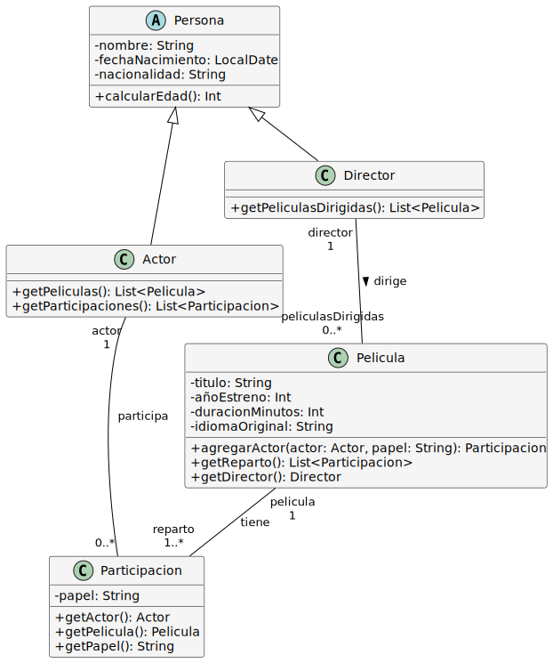
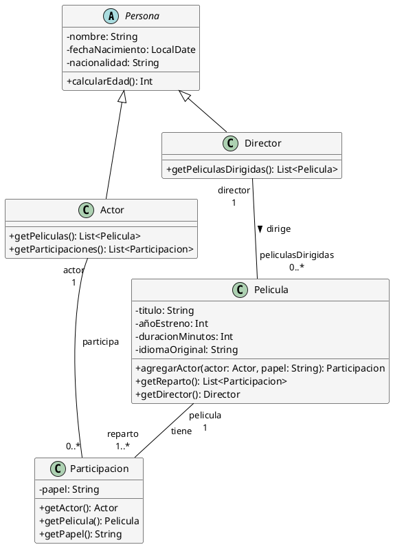

# Solución: Ejercicio 9 - Sistema de Gestión de Películas

## Análisis del Problema

### Identificación de Clases

Del análisis de las especificaciones, identificamos las siguientes clases:

1. **Persona** (Clase Abstracta)
   - Representa la clase base para actores y directores
   - Atributos: nombre, fechaNacimiento, nacionalidad
   - Métodos: calcularEdad()

2. **Actor** (Especialización de Persona)
   - Representa a un actor de cine
   - Métodos: getPeliculas(), getParticipaciones()

3. **Director** (Especialización de Persona)
   - Representa a un director de cine
   - Métodos: getPeliculasDirigidas()

4. **Pelicula**
   - Representa una película
   - Atributos: titulo, añoEstreno, duracionMinutos, idiomaOriginal
   - Métodos: agregarActor(), getReparto(), getDirector()

5. **Participacion** (Clase de Asociación)
   - Relaciona Actor con Película
   - Atributos: papel (personaje interpretado)
   - Métodos: getActor(), getPelicula(), getPapel()

## Análisis de Relaciones

### 1. Herencia (Persona → Actor/Director)
- **Tipo**: Herencia
- **Justificación**: Actor y Director comparten atributos comunes (nombre, fecha nacimiento, nacionalidad)

### 2. Asociación (Director - Película)
- **Tipo**: Asociación 1:N
- **Cardinalidad**: 
  - Un Director puede dirigir 0..* Películas
  - Una Película tiene exactamente 1 Director
- **Justificación**: Cada película tiene un único director responsable

### 3. Clase de Asociación (Actor - Película = Participación)
- **Tipo**: Clase de asociación N:M
- **Cardinalidad**:
  - Un Actor participa en 0..* Películas
  - Una Película tiene 1..* Actores (mínimo uno)
- **Atributo propio**: papel (personaje interpretado)
- **Justificación**: El papel es específico de cada participación, no del actor ni de la película

## Tabla de Roles y Cardinalidades

| Relación | Clase Origen | Rol Origen | Cardinalidad Origen | Clase Destino | Rol Destino | Cardinalidad Destino |
|----------|--------------|------------|---------------------|---------------|-------------|----------------------|
| Herencia | Persona | - | - | Actor | - | - |
| Herencia | Persona | - | - | Director | - | - |
| Asociación | Director | director | 1 | Pelicula | peliculasDirigidas | 0..* |
| Clase Asociación | Actor | actor | 1 | Pelicula | peliculas | 0..* |
| (Participación) | | | | | reparto | 1..* |

## Decisiones de Diseño

### ¿Por qué Persona como clase abstracta?
Actores y directores comparten nombre, fecha de nacimiento y nacionalidad. Una clase base abstracta evita duplicación de código y permite tratamiento polimórfico cuando sea necesario.

### ¿Por qué Participación como clase separada?
El "papel" (personaje interpretado) no pertenece al Actor ni a la Película, sino a la relación específica entre ambos. Un actor puede interpretar diferentes papeles en diferentes películas.

### ¿Director como asociación simple vs herencia?
Usamos herencia porque Director "es una" Persona. La asociación Director-Película es adicional y representa la responsabilidad de dirigir.

### ¿Cardinalidad 1..* para actores?
Una película debe tener al menos un actor. Una película sin actores no tiene sentido en este dominio. El máximo es ilimitado (*).

### ¿Cómo almacenar el papel del actor?
El papel se almacena en la clase Participación. Cada instancia de Participación conecta un Actor específico con una Película específica y guarda el papel que interpreta.

## Diagrama de Clases



## Código PlantUML



## Implementación en Kotlin

```kotlin
import java.time.LocalDate
import java.time.Period

/**
 * Clase abstracta base para personas (actores y directores)
 */
abstract class Persona(
    val nombre: String,
    private val fechaNacimiento: LocalDate,
    val nacionalidad: String
) {
    fun calcularEdad(): Int {
        return Period.between(fechaNacimiento, LocalDate.now()).years
    }
    
    override fun toString(): String {
        return "$nombre ($nacionalidad, ${calcularEdad()} años)"
    }
}

/**
 * Clase que representa un actor
 */
class Actor(
    nombre: String,
    fechaNacimiento: LocalDate,
    nacionalidad: String
) : Persona(nombre, fechaNacimiento, nacionalidad) {
    
    private val participaciones: MutableList<Participacion> = mutableListOf()
    
    fun agregarParticipacion(participacion: Participacion) {
        if (participacion.actor == this && participacion !in participaciones) {
            participaciones.add(participacion)
        }
    }
    
    fun getPeliculas(): List<Pelicula> {
        return participaciones.map { it.pelicula }
    }
    
    fun getParticipaciones(): List<Participacion> {
        return participaciones.toList()
    }
    
    fun getPapelEn(pelicula: Pelicula): String? {
        return participaciones.find { it.pelicula == pelicula }?.papel
    }
}

/**
 * Clase que representa un director
 */
class Director(
    nombre: String,
    fechaNacimiento: LocalDate,
    nacionalidad: String
) : Persona(nombre, fechaNacimiento, nacionalidad) {
    
    private val peliculasDirigidas: MutableList<Pelicula> = mutableListOf()
    
    fun agregarPelicula(pelicula: Pelicula) {
        if (pelicula.director == this && pelicula !in peliculasDirigidas) {
            peliculasDirigidas.add(pelicula)
        }
    }
    
    fun getPeliculasDirigidas(): List<Pelicula> {
        return peliculasDirigidas.toList()
    }
}

/**
 * Clase que representa una participación de un actor en una película
 */
class Participacion(
    val actor: Actor,
    val pelicula: Pelicula,
    val papel: String
) {
    init {
        actor.agregarParticipacion(this)
    }
    
    fun getActor(): Actor = actor
    fun getPelicula(): Pelicula = pelicula
    fun getPapel(): String = papel
    
    override fun toString(): String {
        return "${actor.nombre} como '$papel' en '${pelicula.titulo}'"
    }
}

/**
 * Clase que representa una película
 */
class Pelicula(
    val titulo: String,
    val añoEstreno: Int,
    val duracionMinutos: Int,
    val idiomaOriginal: String,
    val director: Director
) {
    private val reparto: MutableList<Participacion> = mutableListOf()
    
    init {
        director.agregarPelicula(this)
    }
    
    /**
     * Agrega un actor al reparto especificando su papel
     */
    fun agregarActor(actor: Actor, papel: String): Participacion {
        // Verificar que el actor no esté ya en el reparto
        val participacionExistente = reparto.find { it.actor == actor }
        if (participacionExistente != null) {
            println("⚠️  ${actor.nombre} ya está en el reparto de '$titulo'")
            return participacionExistente
        }
        
        val participacion = Participacion(actor, this, papel)
        reparto.add(participacion)
        println("✓ ${actor.nombre} agregado a '$titulo' como '$papel'")
        return participacion
    }
    
    fun getReparto(): List<Participacion> {
        return reparto.toList()
    }
    
    fun getDirector(): Director = director
    
    fun getActores(): List<Actor> {
        return reparto.map { it.actor }
    }
    
    override fun toString(): String {
        return "'$titulo' ($añoEstreno) - Dir: ${director.nombre} - $duracionMinutos min - $idiomaOriginal"
    }
    
    fun mostrarFichaTecnica() {
        println("\n" + "═".repeat(60))
        println("FICHA TÉCNICA")
        println("═".repeat(60))
        println("Título: $titulo")
        println("Año: $añoEstreno")
        println("Duración: $duracionMinutos minutos")
        println("Idioma: $idiomaOriginal")
        println("Director: ${director.nombre}")
        println("\nREPARTO:")
        reparto.forEach { println("  • ${it.actor.nombre} .......... ${it.papel}") }
        println("═".repeat(60))
    }
}

/**
 * Clase gestora del sistema de películas
 */
class SistemaPeliculas {
    private val peliculas: MutableList<Pelicula> = mutableListOf()
    private val actores: MutableList<Actor> = mutableListOf()
    private val directores: MutableList<Director> = mutableListOf()
    
    fun registrarPelicula(pelicula: Pelicula) {
        peliculas.add(pelicula)
        println("✓ Película '${pelicula.titulo}' registrada")
    }
    
    fun registrarActor(actor: Actor) {
        actores.add(actor)
        println("✓ Actor ${actor.nombre} registrado")
    }
    
    fun registrarDirector(director: Director) {
        directores.add(director)
        println("✓ Director ${director.nombre} registrado")
    }
    
    fun buscarPeliculasPorDirector(director: Director): List<Pelicula> {
        return peliculas.filter { it.director == director }
    }
    
    fun buscarPeliculasPorActor(actor: Actor): List<Pelicula> {
        return peliculas.filter { actor in it.getActores() }
    }
    
    fun buscarPeliculasPorAño(año: Int): List<Pelicula> {
        return peliculas.filter { it.añoEstreno == año }
    }
    
    fun mostrarFilmografia(persona: Persona) {
        println("\n" + "═".repeat(60))
        when (persona) {
            is Director -> {
                println("FILMOGRAFÍA DE ${persona.nombre} (Director)")
                println("═".repeat(60))
                val peliculas = buscarPeliculasPorDirector(persona)
                if (peliculas.isEmpty()) {
                    println("No hay películas registradas")
                } else {
                    peliculas.sortedBy { it.añoEstreno }.forEach {
                        println("• ${it.añoEstreno} - ${it.titulo}")
                    }
                }
            }
            is Actor -> {
                println("FILMOGRAFÍA DE ${persona.nombre} (Actor)")
                println("═".repeat(60))
                val participaciones = persona.getParticipaciones()
                if (participaciones.isEmpty()) {
                    println("No hay películas registradas")
                } else {
                    participaciones.sortedBy { it.pelicula.añoEstreno }.forEach {
                        println("• ${it.pelicula.añoEstreno} - ${it.pelicula.titulo} como '${it.papel}'")
                    }
                }
            }
        }
        println("═".repeat(60))
    }
}

/**
 * Función principal de demostración
 */
fun main() {
    println("╔════════════════════════════════════════════════════╗")
    println("║   SISTEMA DE GESTIÓN DE PELÍCULAS         ║")
    println("╚════════════════════════════════════════════════════╝\n")
    
    val sistema = SistemaPeliculas()
    
    // Crear directores
    println("--- REGISTRO DE DIRECTORES ---\n")
    val wachowski = Director("Lana Wachowski", LocalDate.of(1965, 6, 21), "Estados Unidos")
    val nolan = Director("Christopher Nolan", LocalDate.of(1970, 7, 30), "Reino Unido")
    val spielberg = Director("Steven Spielberg", LocalDate.of(1946, 12, 18), "Estados Unidos")
    
    sistema.registrarDirector(wachowski)
    sistema.registrarDirector(nolan)
    sistema.registrarDirector(spielberg)
    
    // Crear actores
    println("\n--- REGISTRO DE ACTORES ---\n")
    val keanu = Actor("Keanu Reeves", LocalDate.of(1964, 9, 2), "Canadá")
    val laurence = Actor("Laurence Fishburne", LocalDate.of(1961, 7, 30), "Estados Unidos")
    val carrieAnne = Actor("Carrie-Anne Moss", LocalDate.of(1967, 8, 21), "Canadá")
    val dicaprio = Actor("Leonardo DiCaprio", LocalDate.of(1974, 11, 11), "Estados Unidos")
    val tomHanks = Actor("Tom Hanks", LocalDate.of(1956, 7, 9), "Estados Unidos")
    
    sistema.registrarActor(keanu)
    sistema.registrarActor(laurence)
    sistema.registrarActor(carrieAnne)
    sistema.registrarActor(dicaprio)
    sistema.registrarActor(tomHanks)
    
    // Crear películas
    println("\n--- REGISTRO DE PELÍCULAS ---\n")
    
    val matrix = Pelicula("The Matrix", 1999, 136, "Inglés", wachowski)
    sistema.registrarPelicula(matrix)
    matrix.agregarActor(keanu, "Neo")
    matrix.agregarActor(laurence, "Morpheus")
    matrix.agregarActor(carrieAnne, "Trinity")
    
    println()
    val inception = Pelicula("Inception", 2010, 148, "Inglés", nolan)
    sistema.registrarPelicula(inception)
    inception.agregarActor(dicaprio, "Dom Cobb")
    
    println()
    val interstellar = Pelicula("Interstellar", 2014, 169, "Inglés", nolan)
    sistema.registrarPelicula(interstellar)
    
    println()
    val savingPrivateRyan = Pelicula("Saving Private Ryan", 1998, 169, "Inglés", spielberg)
    sistema.registrarPelicula(savingPrivateRyan)
    savingPrivateRyan.agregarActor(tomHanks, "Captain Miller")
    
    // Mostrar fichas técnicas
    println("\n" + "=".repeat(70))
    println("FICHAS TÉCNICAS DE PELÍCULAS")
    println("=".repeat(70))
    
    matrix.mostrarFichaTecnica()
    inception.mostrarFichaTecnica()
    
    // Mostrar filmografías
    sistema.mostrarFilmografia(nolan)
    sistema.mostrarFilmografia(keanu)
    sistema.mostrarFilmografia(dicaprio)
    
    // Consultas
    println("\n--- CONSULTAS DEL SISTEMA ---\n")
    
    println("1. Películas de Christopher Nolan:")
    sistema.buscarPeliculasPorDirector(nolan).forEach {
        println("   • ${it.titulo} (${it.añoEstreno})")
    }
    
    println("\n2. Películas con Keanu Reeves:")
    sistema.buscarPeliculasPorActor(keanu).forEach {
        val papel = keanu.getPapelEn(it)
        println("   • ${it.titulo} (${it.añoEstreno}) como '$papel'")
    }
    
    println("\n3. Películas del año 1999:")
    sistema.buscarPeliculasPorAño(1999).forEach {
        println("   • ${it.titulo} - Dir: ${it.director.nombre}")
    }
    
    // Validación: intentar agregar actor duplicado
    println("\n--- VALIDACIÓN: ACTOR DUPLICADO ---\n")
    matrix.agregarActor(keanu, "Otro Personaje")
    
    println("\n" + "=".repeat(70))
    println("FIN DE LA DEMOSTRACIÓN")
    println("=".repeat(70))
}
```

## Ejemplo de Uso y Salida

```
╔════════════════════════════════════════════════════╗
║   SISTEMA DE GESTIÓN DE PELÍCULAS         ║
╚════════════════════════════════════════════════════╝

--- REGISTRO DE DIRECTORES ---

✓ Director Lana Wachowski registrado
✓ Director Christopher Nolan registrado
✓ Director Steven Spielberg registrado

--- REGISTRO DE ACTORES ---

✓ Actor Keanu Reeves registrado
✓ Actor Laurence Fishburne registrado
✓ Actor Carrie-Anne Moss registrado
✓ Actor Leonardo DiCaprio registrado
✓ Actor Tom Hanks registrado

--- REGISTRO DE PELÍCULAS ---

✓ Película 'The Matrix' registrada
✓ Keanu Reeves agregado a 'The Matrix' como 'Neo'
✓ Laurence Fishburne agregado a 'The Matrix' como 'Morpheus'
✓ Carrie-Anne Moss agregado a 'The Matrix' como 'Trinity'

✓ Película 'Inception' registrada
✓ Leonardo DiCaprio agregado a 'Inception' como 'Dom Cobb'

✓ Película 'Interstellar' registrada

✓ Película 'Saving Private Ryan' registrada
✓ Tom Hanks agregado a 'Saving Private Ryan' como 'Captain Miller'

======================================================================
FICHAS TÉCNICAS DE PELÍCULAS
======================================================================

════════════════════════════════════════════════════════════
FICHA TÉCNICA
════════════════════════════════════════════════════════════
Título: The Matrix
Año: 1999
Duración: 136 minutos
Idioma: Inglés
Director: Lana Wachowski

REPARTO:
  • Keanu Reeves .......... Neo
  • Laurence Fishburne .......... Morpheus
  • Carrie-Anne Moss .......... Trinity
════════════════════════════════════════════════════════════

════════════════════════════════════════════════════════════
FICHA TÉCNICA
════════════════════════════════════════════════════════════
Título: Inception
Año: 2010
Duración: 148 minutos
Idioma: Inglés
Director: Christopher Nolan

REPARTO:
  • Leonardo DiCaprio .......... Dom Cobb
════════════════════════════════════════════════════════════

════════════════════════════════════════════════════════════
FILMOGRAFÍA DE Christopher Nolan (Director)
════════════════════════════════════════════════════════════
• 2010 - Inception
• 2014 - Interstellar
════════════════════════════════════════════════════════════

════════════════════════════════════════════════════════════
FILMOGRAFÍA DE Keanu Reeves (Actor)
════════════════════════════════════════════════════════════
• 1999 - The Matrix como 'Neo'
════════════════════════════════════════════════════════════

════════════════════════════════════════════════════════════
FILMOGRAFÍA DE Leonardo DiCaprio (Actor)
════════════════════════════════════════════════════════════
• 2010 - Inception como 'Dom Cobb'
════════════════════════════════════════════════════════════

--- CONSULTAS DEL SISTEMA ---

1. Películas de Christopher Nolan:
   • Inception (2010)
   • Interstellar (2014)

2. Películas con Keanu Reeves:
   • The Matrix (1999) como 'Neo'

3. Películas del año 1999:
   • The Matrix - Dir: Lana Wachowski

--- VALIDACIÓN: ACTOR DUPLICADO ---

⚠️  Keanu Reeves ya está en el reparto de 'The Matrix'

======================================================================
FIN DE LA DEMOSTRACIÓN
======================================================================
```

## Conceptos Clave de UML Aplicados

1. **Herencia**
   - Persona como clase base abstracta
   - Actor y Director heredan atributos comunes

2. **Clase de Asociación**
   - Participación modela relación Actor-Película con atributo papel
   - El papel es específico de cada participación

3. **Asociación 1:N**
   - Director → Película (un director, múltiples películas)

4. **Asociación N:M**
   - Actor ↔ Película (múltiples actores, múltiples películas)
   - Implementada mediante clase Participación

5. **Cardinalidades**
   - Película debe tener al menos 1 actor (1..*)
   - Director es obligatorio (1)

6. **Navegabilidad Bidireccional**
   - Desde Actor puedes obtener sus Películas
   - Desde Película puedes obtener su Reparto

## Verificación de Criterios de Evaluación

- ✅ **CE a)** Entidades identificadas: Película, Persona, Actor, Director, Participación
- ✅ **CE b)** Herencia: Persona → Actor/Director
- ✅ **CE c)** Relación N:M entre Actor y Película
- ✅ **CE d)** Participación como clase de asociación con atributo papel
- ✅ **CE e)** Relación 1:N Director-Película
- ✅ **CE f)** Edad calculada desde fechaNacimiento
- ✅ **CE g)** Cardinalidades: 1 director, 1..* actores
- ✅ **CE h)** Navegabilidad bidireccional implementada

## Posibles Extensiones

1. **Géneros**: Añadir clasificación por género (acción, drama, comedia)
2. **Valoraciones**: Sistema de puntuaciones y reseñas
3. **Premios**: Oscars, Globos de Oro ganados
4. **Productoras**: Empresas productoras de películas
5. **Taquilla**: Recaudación y presupuesto
6. **Series de TV**: Extender para episodios y temporadas
7. **Equipo técnico**: Guionistas, directores de fotografía, compositores

---

**Archivo de diagrama**: `assets/Ej9_Peliculas.svg`
**Nivel de dificultad**: Intermedio
**Conceptos principales**: Herencia, Clase de Asociación, N:M
